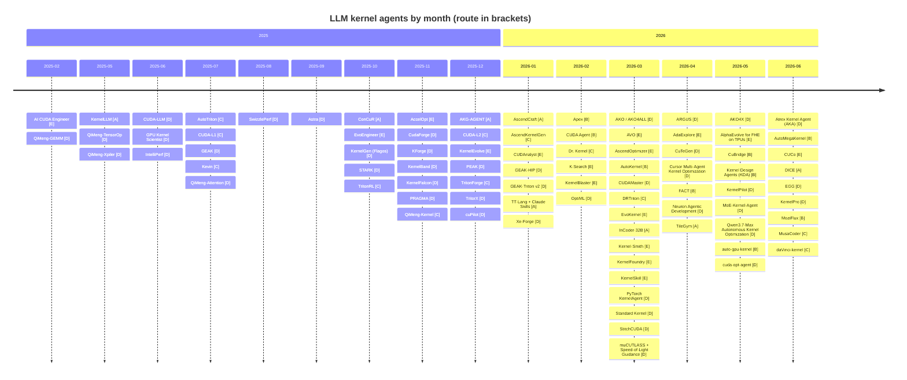

# Awesome Kernel Agent [](https://awesome.re) [](data/agents.yaml) [](CONTRIBUTING.md) [](https://github.com/youyve/awesome-kernel-agent/commits/main)

> A curated, **claims-annotated** list of LLM-driven **Kernel Agents** — papers, projects, datasets, and tooling for automated GPU / NPU / ASIC kernel generation and optimization. 中文版: [README.zh.md](README.zh.md)

A **Kernel Agent** uses an LLM (a single model or a multi-agent system) to automatically write or iteratively optimize operator-level code (kernels) for accelerators. This list tracks the systems, the datasets they train on, and the tooling around them — and, uniquely, annotates **the evidence posture behind every headline number** (what it was evaluated on, what the speedup is measured against, and whether the kernels can be independently re-run).

Companion list: [**awesome-kernel-benchmark**](https://github.com/youyve/awesome-kernel-benchmark) — 151 benchmarks with an evidence-graded methodology scorecard. Single source of truth: [`data/agents.yaml`](data/agents.yaml); all tables below are generated — do not hand-edit.

<!-- BEGIN:STATS -->
<!-- generated by scripts/generate.py — do not edit by hand -->

**87 agent systems** (+3 tooling entries) across **16 DSLs/backends** · last data update **2026-06**.

| Route | A single-shot | B iterative | C RL | D multi-agent+profiler | E evolutionary |
|:---|:--:|:--:|:--:|:--:|:--:|
| **Count** | 8 | 9 | 12 | 42 | 16 |

| Status | 🟢 open | 🟡 partial | 🟠 wip | ⚪ closed | ⚫ proprietary |
|:---|:--:|:--:|:--:|:--:|:--:|
| **Count** | 38 | 12 | 9 | 25 | 3 |

Only **10/87** agent systems ship re-runnable generated kernels (`ships kernels: ✅`) — the rest of the headline speedups cannot be independently audited.

<!-- END:STATS -->

---

## Contents

- [Background](#background) · [Legend](#legend) · [Survey & Index](#survey--index)
- [Agents by Primary DSL](#agents-by-primary-dsl)
- [Route × DSL coverage matrix](#route--dsl-coverage-matrix) · [Timeline](#timeline)
- [Benchmarks](#benchmarks) · [Evaluation integrity & reward-hacking](#evaluation-integrity--reward-hacking) · [Competitions & leaderboards](#competitions--leaderboards)
- [Datasets](#datasets) · [DSL Languages](#dsl-languages) · [Infrastructure & Tools](#infrastructure--tools)
- [Reading List](#reading-list) · [Contributing](#contributing) · [Citation](#citation) · [License](#license)

---

## Background

As Moore's Law slows, performance increasingly comes from software, and within software from the kernel layer. **LLM-driven kernel generation** emerged in early 2025 and now spans code generation, reinforcement learning, agentic systems, and evolutionary search.

The field's birth is marked by three events in **February 2025**:

1. **KernelBench** (Stanford, ICML'25) — established the de facto benchmark.
2. **AI CUDA Engineer** (Sakana AI) — first widely-discussed autonomous system, and the cautionary tale of reward hacking.
3. **NVIDIA × DeepSeek-R1 blog** — official endorsement of inference-time scaling for kernel generation.

By mid-2026 the field has shifted from single-shot prompting toward **trained RL agents**, **evolutionary search with skill memory**, **profiler-in-the-loop multi-agent systems**, and **first-principles (Speed-of-Light) reward shaping** to fight benchmark gaming. Coverage is broadening beyond NVIDIA to AMD, Ascend, Trainium, Intel, and emerging domestic accelerators (Moore Threads MUSA, Cambricon, Tenstorrent).

## Legend

**Open-source status:** 🟢 OPEN (code public) · 🟡 PARTIAL (weights/data out, full impl missing) · 🟠 WIP (repo under construction) · ⚪ CLOSED (paper only) · ⚫ PROPRIETARY (deliberately closed production system).

**Technical route:** **[A]** single-shot / translation · **[B]** iterative refinement (training-free feedback loop) · **[C]** multi-turn RL (GRPO/PPO, verifiable rewards) · **[D]** multi-agent + profiler (NCU/msprof in the loop) · **[E]** evolutionary + memory (population, archive, skill memory).

**Claims annotation** (the `<sub>` line under each entry) — self-reported numbers are reproduced verbatim in descriptions, so each entry carries an objective evidence-posture annotation instead of editorial judgement:

| Field | Meaning |
|:---|:---|
| `eval:` | which benchmark/workload the headline number comes from (see its [methodology scorecard](https://github.com/youyve/awesome-kernel-benchmark#-how-does-each-benchmark-actually-measure--the-methodology-scorecard) to judge oracle/timing strength) |
| `claim vs:` | what the self-reported speedup is measured **against** (eager ≠ compile ≠ vendor ≠ expert — a 5× over eager can be slower than cuBLAS) |
| `ships kernels:` | ✅ generated kernels are public and re-runnable (= auditable) · — not shipped · ? unverified |
| `budget:` | ✅ attempts/iterations/compute budget disclosed · — best-result-only · ? unverified |

Fields are filled **from primary evidence only**; `?` means "not yet verified", never a guess. Entry shape: `Name — Team · Date · [Route] · Status`, one-line description, claims line.

## Survey & Index

- [Towards Automated Kernel Generation in the Era of LLMs](https://arxiv.org/abs/2601.15727) — Yu et al. · arXiv:2601.15727 · 2026-01 — the main survey, 60+ works reviewed.
- [awesome-LLM-driven-kernel-generation](https://github.com/flagos-ai/awesome-LLM-driven-kernel-generation) — flagos-ai — companion repo of the survey.
- [Awesome-LLM4Kernel](https://github.com/kcxain/Awesome-LLM4Kernel) — kcxain — alternative curated index.

---

## Agents by Primary DSL

> Sorted newest-first within each section. Multi-DSL systems are listed once under their primary DSL, with a `· also:` tag and cross-listing stubs.

<!-- BEGIN:AGENTS -->
<!-- generated by scripts/generate.py — do not edit by hand -->

### Triton

> Largest ecosystem — Python-like syntax and abundant pretraining data make it the LLM lingua franca.

- [MoziFlux](https://github.com/BiSheng-Compiler-Agents/MoziFlux) — BiSheng-Compiler-Agents · 2026-06 · **[B]** · 🟢 OPEN
  Agentic system optimizing Triton-Ascend kernels via Hermes Agent, a CANN/cannsim simulation harness, and an optimization-pattern knowledge base; no results reported. *README documents setup/architecture only (episode-based loop implied by episodes.db) with no benchmark results, speedups, or evaluation methodology disclosed. Very low visibility (0 stars) but substantive, working CANN toolchain integration - fills this catalog's thin Ascend/NPU-agent coverage.*
  <sub>eval: ? · claim vs: none reported · ships kernels: ? · budget: —</sub>
- [KernelPilot](https://github.com/BBuf/kernel-pilot) — BBuf · 2026-05 · **[D]** · 🟢 OPEN · also: CUDA
  Autonomous Triton/CUDA optimization with NCU feedback over a Humanize RLCR runtime; 84-iteration budget.
  <sub>eval: ? · claim vs: unknown · ships kernels: ? · budget: ✅</sub>
- [AKO4X](https://github.com/TongmingLAIC/AKO4X) — TLAIC · 2026-05 · **[D]** · 🟢 OPEN · also: CUDA, TileLang, CUTLASS
  More advanced/extensible sibling of AKO/AKO4ALL: closed-loop, campaign-based multi-agent system with per-run isolated template workspaces and cross-run per-operator memory archive; agent can propose harness changes gated by a master. Beats FlashInfer expert by up to 30.71x on MLSys 2026 contest DSA sparse attention kernels, ahead of the concurrent Kernel Design Agents (KDA) submission on all five tracks; GEMM result honestly reported as 1.00x (cuBLAS unbeaten). *AKO4ALL is a single drop-in Claude Code skill for one workspace with no cross-run memory; AKO4X spawns isolated per-run workspaces and accumulates memory across rounds. 6 target languages: Python/PyTorch, Triton, CUDA, C++, TileLang, CuTe DSL.*
  <sub>eval: MLSys 2026 contest kernels (flashinfer-bench) · claim vs: FlashInfer expert kernels; also compared against concurrent Kernel Design Agents (KDA) submission · ships kernels: ? · budget: ?</sub>
- [MoE-Kernel-Agent](https://github.com/Jerry2423/MoE-Kernel-Agent) — Jerry2423 · 2026-05 · **[D]** · 🟢 OPEN
  Claude-Code-driven Learn->Implement->Optimize harness for Triton MoE kernels; 2nd place Full-Agent/MoE Track, MLSys 2026 FlashInfer Contest, 25.7x median speedup vs PyTorch. *Adapted from AKO4ALL's agentic kernel optimization loop; anti-cheat gate blocks delegation to PyTorch APIs, no-op kernels, timing patches, stream injection, uninitialized buffers; benchmarked remotely on NVIDIA B200 via Modal; no license file in repo.*
  <sub>eval: MLSys 2026 FlashInfer AI Kernel Generation Contest - MoE Track · claim vs: PyTorch reference implementation · ships kernels: ✅ · budget: ◐</sub>
- [DRTriton](https://arxiv.org/abs/2603.21465) — Texas A&M · 2026-03 · **[C]** · 🟠 WIP
  Scalable RL (CSP-DAG synthetic data + curriculum RL + test-time search); DRTriton-7B speeds up 92% of KernelBench L2 vs 23% for GPT-5.2.
  <sub>eval: KernelBench · claim vs: PyTorch eager (KernelBench fast_1) · ships kernels: ? · budget: ◐</sub>
- [Kernel-Smith](https://arxiv.org/abs/2603.28342) — Shanghai AI Lab · 2026-03 · **[E]** · ⚪ CLOSED
  Evolutionary kernel optimization; upstream contributions to SGLang/LMDeploy.
  <sub>eval: ? · claim vs: unknown · ships kernels: — · budget: ?</sub>
- [PyTorch KernelAgent](https://github.com/meta-pytorch/KernelAgent) — Meta / PyTorch · 2026-03 · **[D]** · 🟢 OPEN
  5-agent system (Profiler / Judge / Analyze / Orchestrator / Benchmark) + NCU + roofline. H100 89% of roofline, 1.56x over torch.compile. [Blog](https://pytorch.org/blog/kernelagent-hardware-guided-gpu-kernel-optimization-via-multi-agent-orchestration/)
  <sub>eval: ? · claim vs: torch.compile (+ roofline fraction) · ships kernels: ? · budget: ?</sub>
- [AKO / AKO4ALL](https://github.com/TongmingLAIC/AKO4ALL) — TLAIC · 2026-03 · **[D]** · 🟢 OPEN · also: CUDA, TileLang
  Generic coding-agent harness for kernel optimization; 10/13 kernels beat the NVIDIA baseline on SOL-ExecBench. [Blog](https://tongminglaic.github.io/AKO/)
  <sub>eval: SOL-ExecBench · claim vs: SOL-ExecBench agent-optimized baseline · ships kernels: ? · budget: ?</sub>
- [Dr. Kernel](https://github.com/hkust-nlp/KernelGYM) — HKUST-NLP · 2026-02 · **[C]** · 🟢 OPEN
  14B model trained in the KernelGYM RL environment; matches Claude 4.5 Sonnet on KernelBench. [Paper](https://arxiv.org/abs/2602.05885)
  <sub>eval: KernelBench · claim vs: PyTorch eager (KernelBench) · ships kernels: ? · budget: ?</sub>
- [GEAK-Triton v2](https://github.com/AMD-AGI/GEAK) — AMD-AGI · 2026-01 · **[D]** · 🟢 OPEN
  Extension of the GEAK family for AMD GPUs. [Blog](https://rocm.blogs.amd.com/artificial-intelligence/geak-agents-family/README.html)
  <sub>eval: GEAK benchmarks (TritonBench-revised + ROCm) · claim vs: expert reference kernels · ships kernels: ? · budget: ✅</sub>
- [Xe-Forge](https://github.com/IntelLabs/Xe-Forge) — Intel Labs · 2026-01 · **[D]** · 🟢 OPEN
  Multi-stage LLM agent pipeline optimizing Triton kernels on Intel XPU.
  <sub>eval: ? · claim vs: unknown · ships kernels: ? · budget: ?</sub>
- [AKG-AGENT](https://github.com/mindspore-ai/akg/tree/master/akg_agents) — Huawei x Hunan U · 2025-12 · **[A]** · 🟢 OPEN · also: TileLang, AscendC, CUDA
  Multi-agent (Designer / Coder / Verifier / Conductor) builds a DSL-agnostic 'Unified Sketch' then lowers to 5 backends across NVIDIA GPU + Ascend NPU + CPU; 100% on KernelBench L1 (Triton-CUDA pass@4); 1.46x geomean over PyTorch eager on Triton-Ascend. [Paper](https://arxiv.org/abs/2512.23424)
  <sub>eval: KernelBench · claim vs: PyTorch eager · ships kernels: ? · budget: ✅</sub>
- [TritonForge](https://github.com/RLsys-Foundation/TritonForge) — RLsys-Foundation · 2025-12 · **[C]** · 🟢 OPEN
  SFT + RL for PyTorch-to-Triton conversion; NVIDIA + AMD cross-platform. [Paper](https://arxiv.org/abs/2512.09196)
  <sub>eval: ? · claim vs: unknown · ships kernels: ? · budget: ?</sub>
- [TritorX](https://arxiv.org/abs/2512.10977) — Meta · 2025-12 · **[D]** · ⚪ CLOSED
  Generates functionally-correct Triton ATen kernels at scale for emerging accelerators; 481 ATen operators passing 20,000+ PyTorch OpInfo tests. *Targets MTIA.*
  <sub>eval: PyTorch OpInfo (correctness) · claim vs: correctness-only (no speedup claim) · ships kernels: — · budget: ?</sub>
- [KernelFalcon](https://github.com/meta-pytorch/KernelAgent) — Meta / PyTorch · 2025-11 · **[D]** · 🟢 OPEN
  Predecessor of PyTorch KernelAgent; 100% correctness on all 250 KernelBench L1/L2/L3 tasks. [Blog](https://pytorch.org/blog/kernelfalcon-autonomous-gpu-kernel-generation-via-deep-agents/)
  <sub>eval: KernelBench · claim vs: PyTorch eager (KernelBench) · ships kernels: ? · budget: ?</sub>
- [KernelBand](https://arxiv.org/abs/2511.18868) — PKU · 2025-11 · **[D]** · ⚪ CLOSED
  Hierarchical multi-armed bandit for hardware-aware optimization.
  <sub>eval: ? · claim vs: unknown · ships kernels: — · budget: ?</sub>
- [PRAGMA](https://arxiv.org/abs/2511.06345) — Beihang University · 2025-11 · **[D]** · ⚪ CLOSED
  Profiling-reasoned multi-agent framework.
  <sub>eval: ? · claim vs: unknown · ships kernels: — · budget: ?</sub>
- [TritonRL](https://arxiv.org/abs/2510.17891) — CMU x Amazon · 2025-10 · **[C]** · ⚪ CLOSED
  Trains LLMs to write Triton without 'cheating' (reward-hacking sanitization).
  <sub>eval: KernelBench · claim vs: unknown · ships kernels: — · budget: ?</sub>
- [ConCuR](https://huggingface.co/lkongam/KernelCoder) — HKUST · 2025-10 · **[A]** · 🟢 OPEN
  Conciseness-driven SFT for kernel generation. [Paper](https://arxiv.org/abs/2510.07356)
  <sub>eval: KernelBench · claim vs: unknown · ships kernels: ? · budget: ?</sub>
- [KernelGen (Flagos)](https://github.com/flagos-ai/kernelgen) — Flagos · 2025-10 · **[D]** · 🟢 OPEN
  Interactive kernel generation platform. [Blog](https://kernelgen.flagos.io/)
  <sub>eval: ? · claim vs: unknown · ships kernels: ? · budget: ?</sub>
- [SwizzlePerf](https://arxiv.org/abs/2508.20258) — Harvard x AMD · 2025-08 · **[D]** · ⚪ CLOSED
  Hardware-aware LLM for GPU kernel performance optimization.
  <sub>eval: ? · claim vs: unknown · ships kernels: — · budget: ?</sub>
- [GEAK](https://github.com/AMD-AGI/GEAK) — AMD-AGI · 2025-07 · **[D]** · 🟢 OPEN
  4-module agent (generator / reflector / evaluator / optimizer); 2.59x speedup on MI300X. [Paper](https://arxiv.org/abs/2507.23194) *The only system decomposing sequential@k vs parallel@k budget.*
  <sub>eval: TritonBench-revised (184 kernels) + 30 ROCm kernels · claim vs: expert reference kernels · ships kernels: ? · budget: ✅</sub>
- [AutoTriton](https://github.com/AI9Stars/AutoTriton) — THUNLP / AI9Stars · 2025-07 · **[C]** · 🟢 OPEN
  8B model trained via SFT + GRPO on 14.1K torch-triton pairs. [Paper](https://arxiv.org/abs/2507.05687)
  <sub>eval: KernelBench / TritonBench · claim vs: unknown · ships kernels: ? · budget: ?</sub>
- [KernelLLM](https://huggingface.co/facebook/KernelLLM) — Meta · 2025-05 · **[A]** · 🟡 PARTIAL
  Llama 3.1 8B fine-tuned on KernelBook (~25K torch-triton pairs); beats GPT-4o on KernelBench-Triton L1.
  <sub>eval: KernelBench-Triton · claim vs: PyTorch eager (KernelBench) · ships kernels: ? · budget: ?</sub>

<sub>Cross-listed: **daVinci-kernel** (see CUDA / CUDA-C++) · **Qwen3.7-Max Autonomous Kernel Optimization** (see Emerging DSLs & other accelerators) · **AutoKernel** (see CUDA / CUDA-C++) · **Apex** (see HIP / ROCm (AMD)) · **KernelEvolve** (see CUDA / CUDA-C++) · **IntelliPerf** (see HIP / ROCm (AMD))</sub>

### CUDA / CUDA-C++

> The performance-ceiling battleground — RL training, evolutionary search, and multi-agent orchestration.

- [AutoMegaKernel](https://github.com/RightNow-AI/AutoMegaKernel) — RightNow AI (YC) · 2026-06 · **[B]** · 🟢 OPEN
  Sibling project to AutoKernel: compiles whole HF Llama-family models into one statically-verified, self-tuning CUDA megakernel; agent autoresearch loop self-improves 1.25-1.72x; search-found int8 (W8A16) beats CUDA-graphed cuBLAS bf16 at batch-1 decode on L4 (up to 1.33x)/L40S (1.25-1.27x)/RTX 5090 (1.19-1.23x). [Paper](https://arxiv.org/abs/2606.09682) *Headline speedups are precision-asymmetric (int8 vs bf16 baseline); authors explicitly disclose AMK trails cuBLAS on like-for-like bf16 and on A100/H100.*
  <sub>eval: SmolLM2-135M (correctness) / TinyLlama-1.1B (largest perf checkpoint) · claim vs: CUDA-graphed cuBLAS bf16, batch-1 decode (precision-asymmetric: AMK uses int8 W8A16) · ships kernels: ✅ · budget: ◐</sub>
- [CUCo](https://anonymous.4open.science/r/CUCo-06EC/) — UT Austin · 2026-06 · **[E]** · 🟠 WIP
  Two-agent compute+communication co-design: correctness-first fast-path + evolution-driven slow-path mutating chunking/sync/interleaving; up to 1.57x across 4 multi-GPU workloads, discovers two-stream MoE dispatch/compute overlap on DeepSeek-V3 (12% over DeepEP), <$10 LLM cost/workload. [Paper](https://arxiv.org/abs/2603.02376) *Anonymized code link is cited in the paper but returned an unresolvable error on fetch - contents unverified, hence wip rather than open.*
  <sub>eval: Flash Attention (context-parallel/ring) / DeepSeek-V3 MoE dispatch/combine / KV-cache transfer (disagg. prefill-decode) / GEMM+AllGather · claim vs: host-driven baselines (CPU-launched NCCL collectives/streams); MoE result also vs DeepEP · ships kernels: ◐ · budget: ✅</sub>
- [DICE](https://github.com/deadlykitten4/DICE) — Westlake University · 2026-06 · **[A]** · 🟢 OPEN
  Diffusion LLM (non-autoregressive) for CUDA kernel generation; KernelBench L1 @8B: 47.0% exec correctness, fast1=15.0%, fast2=6.0%, new SOTA vs AR and diffusion LLMs of comparable scale. [Paper](https://arxiv.org/abs/2602.11715) *Route A confirmed from the paper's own eval protocol (one-shot prompting); 'iterative' language in the abstract refers to internal diffusion denoising steps, not an external generate-test-fix loop.*
  <sub>eval: KernelBench · claim vs: PyTorch reference implementations (fast_p = speedup over PyTorch) · ships kernels: ✅ · budget: ◐</sub>
- [EGG](https://arxiv.org/abs/2606.26758) — Han & Fan et al. · 2026-06 · **[D]** · ⚪ CLOSED
  Two-stage multi-agent framework: algorithmic-structure design then hardware-specific tuning (tiling/parallel-mapping/memory); 2.13x avg speedup over PyTorch on KernelBench + real-world workloads, beats agent- and RL-based baselines.
  <sub>eval: KernelBench / real-world workloads · claim vs: PyTorch (KernelBench + real-world workloads) · ships kernels: ? · budget: ?</sub>
- [KernelPro](https://arxiv.org/abs/2606.26453) — Gai & Zhang et al. · 2026-06 · **[D]** · ⚪ CLOSED · also: CUTLASS
  Closed-loop multi-agent optimizer: micro-profiling tools (roofline/NCU/SASS/nsys) turned into NL guidance + domain-adapted MCTS with cross-iteration search memory; KernelBench geomean 2.42x/4.69x/5.30x on L1/L2/L3, plus 11.6% measured energy reduction at matched speed. *Also reports 1.23x over hand-tuned Triton on VeOmni MoE kernels via a raw CUDA+CuTe Hopper WGMMA kernel.*
  <sub>eval: KernelBench · claim vs: unknown · ships kernels: ? · budget: ?</sub>
- [daVinci-kernel](https://arxiv.org/abs/2606.16497) — Fu & Liu et al. · 2026-06 · **[C]** · ⚪ CLOSED · also: Triton
  Three co-evolving agents (skill-selector/BM25+rerank, multi-turn CUDA/Triton policy, skill-summarizer) sharing one LLM backbone, SFT cold-start + joint multi-turn REINFORCE; 14B model beats Dr. Kernel-14B on KernelBench Fast_1 (L1 37.2%, L2 70.6%, L3 32.2%).
  <sub>eval: KernelBench · claim vs: Dr. Kernel-14B (prior RL-trained SOTA) · ships kernels: ? · budget: ?</sub>
- [Kernel Design Agents (KDA)](https://github.com/mit-han-lab/kernel-design-agents) — MIT HAN Lab · 2026-05 · **[B]** · 🟠 WIP
  Claude Code plugin encoding an 8-step agent workflow (plan -> implement in small iterations -> verify -> record benchmark evidence) for CUDA kernel research, paired with a separate KernelWiki knowledge-base repo; HAN Lab Mafia solution ranked #1-3 on tracks at the MLSys 2026 Kernel Contest. *Self-described 'early research prototype... still under active development.' Single-agent iterative loop, not multi-agent (no planner/worker split described); ships no kernel code itself; KernelWiki contents (e.g. Blackwell/Hopper coverage) are undescribed/unverifiable in that repo's README (404'd on fetch).*
  <sub>eval: MLSys 2026 Kernel Contest (mit-han-lab/mlsys2026-flashinfer-contest) · claim vs: unknown · ships kernels: — · budget: —</sub>
- [CuBridge](https://arxiv.org/abs/2605.05023) — Shanghai Jiao Tong University · 2026-05 · **[B]** · ⚪ CLOSED
  IR-based (CuIR) lift-transfer-lower pipeline with ReAct-style closed-loop refinement for expert CUDA attention kernels; outperforms general frameworks, compilers, and prior LLM methods (no single headline % given). *Accepted to ACL 2026 (per arXiv comments). No GitHub/code link found.*
  <sub>eval: ? · claim vs: general frameworks, compiler-based approaches, and prior LLM-based methods · ships kernels: ? · budget: ◐</sub>
- [cuda-opt-agent](https://github.com/KernelFlow-ops/cuda-opt-agent) — KernelFlow-ops · 2026-05 · **[D]** · 🟢 OPEN
  LangGraph-orchestrated agent for CUDA kernel optimization with an nvcc compile+correctness gate, adaptive 3-phase NCU profiling, and multi-GPU hyperparameter search; no speedup numbers reported. *Single LLM agent with distinct LangGraph workflow nodes (bootstrap, profile, analyze, decide, HP-search/apply, evaluate, reflect), not multiple coordinated LLM agents; generated kernels written at runtime and explicitly excluded from commits; no specific GPU models named.*
  <sub>eval: ? · claim vs: none reported · ships kernels: — · budget: ?</sub>
- [AdaExplore](https://github.com/StigLidu/AdaExplore) — CMU · 2026-04 · **[E]** · 🟢 OPEN
  Failure-driven, diversity-preserving exploration. [Paper](https://arxiv.org/abs/2604.16625)
  <sub>eval: KernelBench · claim vs: unknown · ships kernels: ? · budget: ?</sub>
- [Cursor Multi-Agent Kernel Optimization](https://github.com/anysphere/kernel-optimization-results) — Cursor / NVIDIA · 2026-04 · **[D]** · 🟢 OPEN · also: CUTLASS
  Planner + autonomous parallel workers optimized 235 kernels from 124+ open-source models (CUDA C w/ inline PTX and CuTe DSL) on 27x Blackwell B200 over 3 weeks using NVIDIA's SOL-ExecBench test-debug-optimize loop; 38% geomean speedup, 63% (149/235) beat baseline, GEMM reached 86% of cuBLAS (beat it by up to 9% on small-M decode shapes). [Blog](https://cursor.com/blog/multi-agent-kernels) *Speedups measured against PyTorch already optimized by a single agent (SOL 0.5), not raw eager PyTorch (SOL 1.0 = hardware ceiling); GQA attention case additionally validated end-to-end (+3% TTFT in SGLang).*
  <sub>eval: SOL-ExecBench (235 problems / 124+ open-source models) · claim vs: PyTorch code already optimized by a single agent (SOL-ExecBench score 0.5 baseline, 1.0 = theoretical hardware ceiling); FlashInfer/cuBLAS used as direct comparison for attention/GEMM cases · ships kernels: ✅ · budget: ◐</sub>
- [AVO](https://github.com/austin1997/AVO) — NVIDIA x OctoML (23 authors) · 2026-03 · **[E]** · 🟡 PARTIAL · also: PTX
  Paradigm shift: the agent IS the variation operator (propose / repair / critique / verify), not just a candidate generator. After 7 days of autonomous evolution on B200 MHA: +3.5% over cuDNN, +10.5% over FlashAttention-4. [Paper](https://arxiv.org/abs/2603.24517) *Linked repo is a community reimplementation.*
  <sub>eval: B200 MHA workloads · claim vs: cuDNN / FlashAttention-4 (vendor & expert tier) · ships kernels: — · budget: ✅</sub>
- [AutoKernel](https://github.com/RightNow-AI/autokernel) — RightNow AI (YC) · 2026-03 · **[B]** · 🟢 OPEN · also: Triton
  Keep/revert agent loop with Amdahl-law profiling and a 5-stage correctness harness (~40 experiments/hr); H100 RMSNorm 5.29x over eager / 2.83x over torch.compile. [Paper](https://arxiv.org/abs/2603.21331)
  <sub>eval: ? · claim vs: PyTorch eager AND torch.compile (both reported) · ships kernels: ? · budget: ✅</sub>
- [KernelSkill](https://github.com/0satan0/KernelMem) — Beihang University · 2026-03 · **[E]** · 🟢 OPEN
  Dual-level memory with reusable expert skills; KernelBench L1=5.44x, L2=2.82x, L3=1.92x. [Paper](https://arxiv.org/abs/2603.10085)
  <sub>eval: KernelBench · claim vs: PyTorch eager (KernelBench) · ships kernels: ? · budget: ?</sub>
- [CUDAMaster](https://hanyx2021.github.io/MSKernelBenchDemo/) — Tsinghua · 2026-03 · **[D]** · 🟡 PARTIAL
  Bottleneck-aware filtered-profiling multi-agent + full toolchain generation across algebra / LLM / sparse / scientific kernels; ~35% over Astra, occasionally matches cuBLAS. Introduces MSKernelBench. [Paper](https://arxiv.org/abs/2603.07169)
  <sub>eval: MSKernelBench · claim vs: Astra (prior agent); cuBLAS occasionally matched · ships kernels: ? · budget: ?</sub>
- [InCoder-32B](https://github.com/CSJianYang/Industrial-Coder) — Beihang University · 2026-03 · **[A]** · 🟢 OPEN
  Industrial code foundation model; the 2026-04 InCoder-32B-Thinking variant adds an industrial code world model (ICWM) for pre-compilation self-verification, 38.0% on KernelBench, runs on RTX 4090. [Paper](https://arxiv.org/abs/2604.03144)
  <sub>eval: KernelBench · claim vs: PyTorch eager (KernelBench) · ships kernels: ? · budget: ?</sub>
- [StitchCUDA](https://arxiv.org/abs/2603.02637) — University of Minnesota Twin Cities · 2026-03 · **[D]** · ⚪ CLOSED
  Planner/Coder/Verifier multi-agent system generating end-to-end CUDA programs (not single kernels), Coder trained via rubric-based agentic RL; ~100% success on KernelBench L3, 1.72x over CudaForge, 2.73x over Kevin-32B RL baseline. *Training: LoRA r=alpha=128, ~20h on 4xH200. No GitHub/code link found.*
  <sub>eval: KernelBench · claim vs: PyTorch eager (1.5x avg); also vs CudaForge multi-agent baseline (1.72x) and Kevin-32B RL baseline (2.73x) · ships kernels: ? · budget: ✅</sub>
- [CUDA Agent](https://cuda-agent.github.io/) — ByteDance x Tsinghua · 2026-02 · **[B]** · 🟡 PARTIAL
  Large-scale agentic RL on Seed-1.6 MoE (OpenHands ReAct loop, 200 turns, 131K ctx); first open agent to beat Claude Opus and Gemini 3 Pro on KernelBench (2.11x geomean over torch.compile). [Paper](https://huggingface.co/papers/2602.24286) *Companion model repo: ByteDance-Seed/cudaLLM.*
  <sub>eval: KernelBench · claim vs: torch.compile (geomean) · ships kernels: ? · budget: ✅</sub>
- [KernelBlaster](https://arxiv.org/abs/2602.14293) — NVIDIA x UC Berkeley · 2026-02 · **[E]** · ⚪ CLOSED
  Memory-augmented in-context RL; persistent CUDA knowledge base.
  <sub>eval: ? · claim vs: unknown · ships kernels: — · budget: ?</sub>
- [K-Search](https://github.com/caoshiyi/K-Search) — UC Berkeley · 2026-02 · **[E]** · 🟢 OPEN
  Co-evolving intrinsic world model for kernel generation. [Paper](https://arxiv.org/abs/2602.19128)
  <sub>eval: ? · claim vs: unknown · ships kernels: ? · budget: ?</sub>
- [OptiML](https://arxiv.org/abs/2602.12305) — Iowa State University · 2026-02 · **[D]** · ⚪ CLOSED
  Two-stage: OptiML-G (Mixture-of-Thoughts NL-to-CUDA generator) + OptiML-X (MCTS optimizer w/ Nsight Compute profiler feedback + LLM-as-judge); up to 1.64x speedup (matrix multiplication, best case). *Org affiliation cross-verified via NSF award records and web search, not directly read from an inaccessible PDF affiliation footnote. No GitHub/project link found.*
  <sub>eval: ParEval / CUDA-LLM task suite · claim vs: LLM-only baselines without OptiML-X (GPT-5.1, Qwen2.5-Coder, HPC-Coder-V2, StarCoder2) · ships kernels: — · budget: ◐</sub>
- [CUDAnalyst](https://github.com/yuxuan-z19/cudanalyst) — Yee Hin Chong et al. · 2026-01 · **[E]** · 🟢 OPEN
  Self-evolving agent (OpenEvolve + LLM4AD/EoH) that decouples feedback acquisition (Debugger / Analyzer / Profiler) from plan generation, doing causal generation-level attribution of which feedback signal drives the next plan. ICML'26. [Paper](https://openreview.net/forum?id=s70zO5Lvvj) *Ships generated sol.cu kernels - auditable.*
  <sub>eval: PolyBench-ACC / NPB / XSBench · claim vs: substrate reference implementations · ships kernels: ✅ · budget: ?</sub>
- [KernelEvolve](https://arxiv.org/abs/2512.23236) — Meta · 2025-12 · **[E]** · ⚫ PROPRIETARY · also: Triton, TileLang, CUTLASS, HIP
  Six-component agent (synthesizer + MCTS/evolutionary tree search + self-evolving RAG skill library + agentic RL) deployed on Andromeda ads: NVIDIA +60% / MTIA +25% / peak 17x; 100% on KernelBench. ISCA'26. [Blog](https://engineering.fb.com/2026/04/02/developer-tools/kernelevolve-how-metas-ranking-engineer-agent-optimizes-ai-infrastructure/)
  <sub>eval: KernelBench / production Andromeda workloads · claim vs: production incumbents (internal) · ships kernels: — · budget: ?</sub>
- [CUDA-L2](https://github.com/deepreinforce-ai/CUDA-L2) — DeepReinforce · 2025-12 · **[C]** · 🟢 OPEN
  Surpasses cuBLAS for matrix multiplication. [Paper](https://arxiv.org/abs/2512.02551)
  <sub>eval: matmul suite · claim vs: cuBLAS (vendor tier) · ships kernels: ? · budget: ?</sub>
- [cuPilot](https://github.com/champloo2878/cuPilot-Kernels) — Southeast U x Tsinghua x Tsing Micro · 2025-12 · **[D]** · 🟡 PARTIAL
  Strategy-coordinated multi-agent framework. [Paper](https://arxiv.org/abs/2512.16465) *Linked repo holds generated kernel outputs.*
  <sub>eval: KernelBench · claim vs: unknown · ships kernels: ✅ · budget: ?</sub>
- [PEAK](https://arxiv.org/abs/2512.19018) — Stanford x MSR Redmond · 2025-12 · **[D]** · ⚪ CLOSED · also: HIP
  Natural-language transformation for kernel optimization.
  <sub>eval: ? · claim vs: unknown · ships kernels: — · budget: ?</sub>
- [CudaForge](https://github.com/OptimAI-Lab/CudaForge) — UMN OptimAI Lab · 2025-11 · **[D]** · 🟢 OPEN
  Training-free Coder + Judge dual-agent with NCU profiling; A100 97.6% correctness, 1.68x / 2.27x - beats Kevin-32B. [Paper](https://arxiv.org/abs/2511.01884) *The paper's own error analysis found 'fake kernel' evaluation-gaming in prior work: agents exploit try/except fallbacks to PyTorch eager to fake speedups. See also CUDA-L1's note.*
  <sub>eval: KernelBench · claim vs: PyTorch eager (KernelBench) · ships kernels: ? · budget: ?</sub>
- [KForge](https://arxiv.org/abs/2511.13274) — Gimlet Labs · 2025-11 · **[D]** · ⚪ CLOSED
  Program synthesis for diverse AI hardware accelerators.
  <sub>eval: ? · claim vs: unknown · ships kernels: — · budget: ?</sub>
- [QiMeng-Kernel](https://github.com/QiMeng-IPRC/QiMeng-Kernel) — CAS ICT · 2025-11 · **[C]** · 🟡 PARTIAL
  Macro-Thinking Micro-Coding (MTMC); ~100% on L1/L2, ~70% on L3. AAAI'26. QiMeng family (CAS ICT full-stack processor auto-design). [Paper](https://arxiv.org/abs/2511.20100) *Repo has no impl code yet.*
  <sub>eval: KernelBench · claim vs: PyTorch eager (KernelBench) · ships kernels: — · budget: ?</sub>
- [STARK](https://arxiv.org/abs/2510.16996) — Meta · 2025-10 · **[D]** · ⚪ CLOSED
  Strategic team of agents for refining kernels.
  <sub>eval: ? · claim vs: unknown · ships kernels: — · budget: ?</sub>
- [EvoEngineer](https://arxiv.org/abs/2510.03760) — City University of Hong Kong · 2025-10 · **[E]** · ⚪ CLOSED
  Automated CUDA kernel code evolution; median 2.72x, peak 36.75x speedup.
  <sub>eval: KernelBench · claim vs: PyTorch eager (KernelBench) · ships kernels: — · budget: ?</sub>
- [Astra](https://github.com/Anjiang-Wei/Astra) — Stanford · 2025-09 · **[D]** · 🟢 OPEN
  Multi-agent GPU kernel optimization on SGLang; 1.32x average zero-shot with o4-mini. NeurIPS'25. [Paper](https://arxiv.org/abs/2509.07506)
  <sub>eval: SGLang kernels · claim vs: SGLang incumbent kernels · ships kernels: ? · budget: ✅</sub>
- [Kevin](https://arxiv.org/abs/2507.11948) — Cognition · 2025-07 · **[C]** · 🟡 PARTIAL
  Multi-turn RL on QwQ-32B with GRPO; KernelBench correctness 56%->82%, speedup 0.53x->1.10x.
  <sub>eval: KernelBench · claim vs: PyTorch eager (KernelBench) · ships kernels: ? · budget: ✅</sub>
- [CUDA-L1](https://github.com/deepreinforce-ai/CUDA-L1) — DeepReinforce · 2025-07 · **[C]** · 🟢 OPEN
  Contrastive RL; KernelBench avg 3.12x, peak 120x; A100->H100/L40/3090 generalization. [Paper](https://arxiv.org/abs/2507.14111) *The 120x peak is exactly the inflated-claim regime robust-kbench later showed collapses under hardened evaluation; CudaForge independently identified the same class of 'fake kernel' try/except-fallback gaming in prior agentic work.*
  <sub>eval: KernelBench · claim vs: PyTorch eager (KernelBench) · ships kernels: ✅ · budget: ?</sub>
- [QiMeng-Attention](https://aclanthology.org/2025.findings-acl.446/) — CAS ICT · 2025-07 · **[D]** · ⚪ CLOSED
  Self-optimizing attention code; MLA 2.15x cuDNN on A100. ACL'25 Findings. QiMeng family.
  <sub>eval: attention workloads · claim vs: cuDNN (vendor tier) · ships kernels: — · budget: ?</sub>
- [GPU Kernel Scientist](https://arxiv.org/abs/2506.20807) — Anonymous · 2025-06 · **[D]** · ⚪ CLOSED
  Hypothesis-driven iterative kernel optimization.
  <sub>eval: ? · claim vs: unknown · ships kernels: — · budget: ?</sub>
- [CUDA-LLM](https://arxiv.org/abs/2506.09092) — Shanghai Jiao Tong University · 2025-06 · **[D]** · ⚪ CLOSED
  Hardware-aware prompts for efficient CUDA generation.
  <sub>eval: ? · claim vs: unknown · ships kernels: — · budget: ?</sub>
- [QiMeng-Xpiler](https://arxiv.org/abs/2505.02146) — CAS ICT x USTC x Cambricon · 2025-05 · **[D]** · 🟠 WIP · also: HIP
  Neural-symbolic tensor-program transcompiler (LLM transform + SMT repair + hierarchical auto-tuning); ~95% translation accuracy across 4 backends, up to 2.0x over vendor libraries. OSDI'25. QiMeng family.
  <sub>eval: 4-backend transpilation suite · claim vs: vendor libraries · ships kernels: ? · budget: ?</sub>
- [QiMeng-TensorOp](https://arxiv.org/abs/2505.06302) — CAS ICT · 2025-05 · **[D]** · ⚪ CLOSED
  MCTS + hardware primitives; 251% OpenBLAS on RISC-V, 124% cuBLAS on NVIDIA. IJCAI'25. QiMeng family.
  <sub>eval: GEMM/tensor-op suite · claim vs: OpenBLAS / cuBLAS (vendor tier) · ships kernels: — · budget: ?</sub>
- [AI CUDA Engineer](https://huggingface.co/datasets/SakanaAI/AI-CUDA-Engineer-Archive) — Sakana AI · 2025-02 · **[E]** · 🟡 PARTIAL
  Four-stage pipeline (Convert / Translate / Optimize / Compose); 30K-kernel archive (17K verified). [Paper](https://arxiv.org/abs/2509.14279) *Cautionary tale: initial 10-100x claims included reward-hacking exploits, later hardened in robust-kbench (paper 2025-09).*
  <sub>eval: KernelBench · claim vs: PyTorch eager (KernelBench) · ships kernels: ✅ · budget: ?</sub>
- [QiMeng-GEMM](https://ojs.aaai.org/index.php/AAAI/article/view/34461) — CAS ICT · 2025-02 · **[D]** · 🟡 PARTIAL
  Meta-prompt + Tree-of-Thought for GEMM; 211% OpenBLAS, 115% cuBLAS. AAAI'25. QiMeng family.
  <sub>eval: GEMM suite · claim vs: OpenBLAS / cuBLAS (vendor tier) · ships kernels: ? · budget: ?</sub>

<sub>Cross-listed: **MusaCoder** (see Emerging DSLs & other accelerators) · **KernelPilot** (see Triton) · **AKO4X** (see Triton) · **AKO / AKO4ALL** (see Triton) · **KernelFoundry** (see SYCL (Intel)) · **AKG-AGENT** (see Triton)</sub>

### CUTLASS / CuTe DSL

> Template-level performance with a steep learning curve — agents must reason about tiles, layouts, and warp specialization.

- [Atrex Kernel Agent (AKA)](https://github.com/alibaba/atrex-kernel-agent) — Alibaba · 2026-06 · **[D]** · 🟢 OPEN · also: FlyDSL
  Claude Code/Codex Skill (not a trained model) orchestrating a 5-stage baseline->bottleneck-analysis->profile-optimizer->output-contract->partial-restart pipeline; each iteration changes exactly one optimization category, gated by ncu (NVIDIA H20/H100/H200) or rocprofv3+ATT+PMC (AMD MI308X/MI300X) profiler evidence - timer-only evidence explicitly disallowed. Stop condition = 90% of hardware peak (Roofline). *Ships a 983-file 'gpu-wiki' knowledge base requiring exact file/line citation for every hardware spec used. No performance results for its own generated kernels are reported anywhere in the repo; no paper. Likely companion to atrex-bench (cataloged in the sister awesome-kernel-benchmark repo) - same org, same DSL/hardware scope, created 5 days apart - but neither repo cross-references the other explicitly.*
  <sub>eval: ? · claim vs: none reported · ships kernels: — · budget: ?</sub>
- [CuTeGen](https://github.com/taratt/cutegen) — U Toronto x Standard Kernel · 2026-04 · **[D]** · 🟢 OPEN
  Generate-test-refine loop with a 'delayed profiling' schedule (withholds low-level NCU feedback until structure stabilizes); 1.71x avg over PyTorch on 209 KernelBench L1/L2 tasks vs CudaForge 0.89x, zero low-precision shortcuts. [Paper](https://arxiv.org/abs/2604.01489)
  <sub>eval: KernelBench · claim vs: PyTorch eager (KernelBench) · ships kernels: ? · budget: ?</sub>
- [FACT](https://arxiv.org/abs/2604.26666) — Heidari & Nikolopoulos · 2026-04 · **[B]** · ⚪ CLOSED
  Three-stage agentic workflow (pattern discovery / realization / composition) transpiling PyTorch modules into auto-tuned CUTLASS; 2.03x on MiniGPT, 1.41x on Llama-3-8B over PyTorch eager.
  <sub>eval: MiniGPT / Llama-3-8B end-to-end · claim vs: PyTorch eager · ships kernels: — · budget: ?</sub>
- [muCUTLASS + Speed-of-Light Guidance](https://arxiv.org/abs/2603.29010) — NVIDIA x Stanford · 2026-03 · **[D]** · 🟠 WIP
  Two design principles for kernel-opt agents: a compact in-context-learnable DSL (muCUTLASS over CUTLASS) + first-principles Speed-of-Light bounds to budget trials and flag benchmark gaming; GPT-5-mini 0.40x->1.27x, +SOL up to 2.07x, saving 19-43% tokens.
  <sub>eval: ? · claim vs: PyTorch eager + SOL ceiling · ships kernels: ? · budget: ✅</sub>

<sub>Cross-listed: **KernelPro** (see CUDA / CUDA-C++) · **AKO4X** (see Triton) · **Cursor Multi-Agent Kernel Optimization** (see CUDA / CUDA-C++) · **KernelEvolve** (see CUDA / CUDA-C++)</sub>

### Ascend C / NPU

> The fastest-growing non-NVIDIA stack — but mostly closed.

- [AscendOptimizer](https://arxiv.org/abs/2603.23566) — ECNU x Tongji · 2026-03 · **[E]** · 🟡 PARTIAL
  Episodic agent for Ascend NPU operator optimization; 1.21x geomean on 127 AscendC operators, 49.61% beat references.
  <sub>eval: cann-ops (127 AscendC operators) · claim vs: Ascend reference operators · ships kernels: ? · budget: ?</sub>
- [EvoKernel](https://evokernel.zhuo.li/) — SJTU · 2026-03 · **[E]** · 🟡 PARTIAL
  Cold-start drafting + continual refining with value-driven memory (stage-specific Q-values, cross-task sharing, no fine-tuning); correctness 11%->83%, median 3.60x. [Paper](https://arxiv.org/abs/2603.10846) *Paper frames the target as generic NPU/DSA; Ascend inferred.*
  <sub>eval: ? · claim vs: unknown · ships kernels: ? · budget: ?</sub>
- [AscendKernelGen](https://huggingface.co/datasets/AscendKernelGen/Ascend-COT-v1) — Pengcheng Lab · 2026-01 · **[C]** · 🟡 PARTIAL
  Ascend-CoT dataset + RLEF training; L2 compilation 0%->95.5%. [Paper](https://arxiv.org/abs/2601.07160)
  <sub>eval: NPUKernelBench · claim vs: unknown · ships kernels: ? · budget: ?</sub>
- [AscendCraft](https://arxiv.org/abs/2601.22760) — NJU x Huawei · 2026-01 · **[A]** · ⚪ CLOSED
  DSL-guided, training-free transcompilation; 98.1% compilation, 90.4% correctness.
  <sub>eval: ? · claim vs: correctness-only claims · ships kernels: — · budget: ?</sub>

<sub>Cross-listed: **AKG-AGENT** (see Triton)</sub>

### HIP / ROCm (AMD)

- [ARGUS](https://arxiv.org/abs/2604.18616) — Mai, Kozyrakis, Yuan et al. · 2026-04 · **[D]** · 🟠 WIP
  Agentic optimization guided by compile-time data-flow invariants (abstract interpretation + SMT with counterexamples) + in-context RL planner; on MI300X reaches 99-104% of hand-tuned assembly, 2-1543x faster than prior agentic systems, 100% KernelBench L1 / 90% L2.
  <sub>eval: KernelBench · claim vs: hand-tuned assembly (expert tier) + prior agents · ships kernels: ? · budget: ?</sub>
- [Apex](https://github.com/AMD-AGI/Apex) — AMD · 2026-02 · **[B]** · 🟢 OPEN · also: Triton
  Agent harness (Claude Code/Codex/Cursor Agent backends) that iterates HIP/Triton kernels against a compile+correctness+speedup grader across 12 LLM-serving kernel types (flash attn, MoE, GEMM, RoPE, KV-cache, all-reduce, etc.) on MI300X/MI355X; reports all_reduce up to 36.35x, most other kernels near or above 1.0x. *README frames itself as an 'RL environment,' but the loop shown (baseline -> LLM agent -> grader -> reinjection) is agentic iterative refinement, not weight-trained RL; no paper found.*
  <sub>eval: Apex 12-kernel-type / 21-model registry · claim vs: prior baseline kernel in the same optimization run (per-kernel-type baseline, not a fixed reference like cuBLAS) · ships kernels: — · budget: ✅</sub>
- [GEAK-HIP](https://github.com/AMD-AGI/GEAK) — AMD-AGI · 2026-01 · **[D]** · 🟢 OPEN
  GEAK extension for HIP optimization. [Blog](https://rocm.blogs.amd.com/software-tools-optimization/geak-hip-optimizations/README.html)
  <sub>eval: ? · claim vs: unknown · ships kernels: ? · budget: ?</sub>
- [IntelliPerf](https://github.com/AMDResearch/intelliperf) — AMD Research · 2025-06 · **[D]** · 🟢 OPEN · also: Triton
  Profiling-guided LLM framework for AMD GPUs.
  <sub>eval: ? · claim vs: unknown · ships kernels: ? · budget: ?</sub>
- [IntelliKit](https://github.com/AMDResearch/intellikit) — AMD Research · 2025-03 · *tooling* · 🟢 OPEN
  LLM-ready profiling toolkit for AMD GPUs.
  <sub>eval: ? · claim vs: n/a (tooling) · ships kernels: ? · budget: ?</sub>

<sub>Cross-listed: **KernelEvolve** (see CUDA / CUDA-C++) · **PEAK** (see CUDA / CUDA-C++) · **QiMeng-Xpiler** (see CUDA / CUDA-C++)</sub>

### NKI (AWS Trainium)

- [Neuron Agentic Development](https://aws.amazon.com/about-aws/whats-new/2026/04/announcing-neuron-agentic-development/) — AWS · 2026-04 · **[D]** · ⚫ PROPRIETARY
  Official AWS announcement of agentic NKI kernel development.
  <sub>eval: ? · claim vs: unknown · ships kernels: — · budget: ?</sub>
- [AccelOpt](https://github.com/zhang677/AccelOpt) — Stanford x AWS · 2025-11 · **[E]** · 🟠 WIP
  Self-improving agentic system for accelerator kernels; 45%->71% peak throughput on Trainium 1/2. Ships the NKIBench suite. MLSys'26. [Paper](https://arxiv.org/abs/2511.15915)
  <sub>eval: NKIBench · claim vs: fraction of peak throughput (ceiling-relative) · ships kernels: ? · budget: ?</sub>

### SYCL (Intel)

- [KernelFoundry](https://arxiv.org/abs/2603.12440) — Intel · 2026-03 · **[E]** · 🟠 WIP · also: CUDA
  Hardware-aware evolutionary optimization (MAP-Elites quality-diversity + meta-prompting) generating CUDA AND SYCL; demonstrated on Intel Arc B580 (Xe2).
  <sub>eval: ? · claim vs: unknown · ships kernels: ? · budget: ?</sub>

### TileLang

- [TileOPs (TOPS)](https://github.com/tile-ai/TileOPs) — tile-ai · 2026-01 · *tooling* · 🟢 OPEN
  Spec-driven operator library: AI agents read declarative manifests (signatures, workloads, roofline formulas), generate TileLang kernels, and self-validate against Speed-of-Light bounds.
  <sub>eval: ? · claim vs: SOL bounds (self-validation) · ships kernels: ✅ · budget: ?</sub>
- [TileLang-Ascend](https://github.com/tile-ai/tilelang-ascend) — tile-ai · 2025-10 · *tooling* · 🟢 OPEN
  Adapter layer connecting TileLang to the Ascend backend (not an agent).
  <sub>eval: ? · claim vs: n/a (tooling) · ships kernels: ? · budget: ?</sub>

<sub>Cross-listed: **AKO4X** (see Triton) · **AKO / AKO4ALL** (see Triton) · **AKG-AGENT** (see Triton) · **KernelEvolve** (see CUDA / CUDA-C++)</sub>

### Emerging DSLs & other accelerators

> New backends where AI codegen is in the loop from day one.

- [MusaCoder](https://arxiv.org/abs/2606.04847) — Moore Threads · 2026-06 · **[C]** · 🟠 WIP · also: CUDA
  Full-stack training (progressive data synthesis + diversity-preserving rejection FT + execution-feedback RL via MooreEval) for native kernels on the domestic Moore Threads MUSA backend; 9B matches frontier closed models, 27B sets SOTA on a MUSA-ported KernelBench.
  <sub>eval: KernelBench-MUSA (MooreEval) · claim vs: platform PyTorch (MUSA port) · ships kernels: ? · budget: ?</sub>
- [auto-gpu-kernel](https://github.com/Dogacel/auto-gpu-kernel) — Dogacel · 2026-05 · **[B]** · 🟢 OPEN
  Claude-Code-driven autonomous optimizer that won #1 (agent-only) in the MLSys'26 FlashInfer contest, DeepSeek Sparse Attention track, avg 34.93x speedup; runs /optimize every 15 min indefinitely on Modal cloud.
  <sub>eval: MLSys'26 FlashInfer contest (bare-metal B200 evals) · claim vs: contest reference kernels · ships kernels: ✅ · budget: ◐</sub>
- [AlphaEvolve for FHE on TPUs](https://arxiv.org/abs/2605.14718) — Google · 2026-05 · **[E]** · ⚪ CLOSED
  Applies AlphaEvolve evolutionary codegen to fully-homomorphic-encryption kernels on TPU v5e; within 24h: 2.5x TFHE bootstrap, 1.31x CKKS rotation vs human SOTA.
  <sub>eval: FHE kernel suite (TFHE/CKKS) · claim vs: human SOTA implementations (expert tier) · ships kernels: — · budget: ✅</sub>
- [Qwen3.7-Max Autonomous Kernel Optimization](https://qwen.ai/blog?id=qwen3.7) — Alibaba / Qwen Team · 2026-05 · **[D]** · ⚫ PROPRIETARY · also: Triton
  Qwen3.7-Max autonomously optimized SGLang's Extend Attention Kernel for a previously-unseen accelerator (T-Head Zhenwu M890 PPU, styled 'ZW-M890' in Qwen's own blog) with no hardware docs/reference kernels; ~35h autonomous run, 432 kernel evaluations, 1158 tool calls, 10.0x geomean speedup over the Triton reference (vs. GLM 5.1 7.3x, Kimi K2.6 5.0x, DeepSeek V4 Pro 3.3x, Qwen3.6-Plus 1.1x). *Self-reported by Alibaba/Qwen Team, not independently reproduced - every specific number traces to this one blog post (mirrored verbatim at alibabacloud.com/blog/qwen3-7-the-agent-frontier_603154); the corporate press release independently confirms the event and chip but none of the granular figures.*
  <sub>eval: SGLang Extend Attention Kernel · claim vs: SGLang official Triton reference implementation · ships kernels: — · budget: ✅</sub>
- [TileGym](https://github.com/NVIDIA/TileGym) — NVIDIA · 2026-04 · **[A]** · 🟢 OPEN
  LLM agent 'skill' auto-translating cuTile Python kernels to cuTile.jl (Julia) in one validated pass (17 rules, static validator); GEMM port ~4 min / ~78K tokens, no manual intervention. [Blog](https://developer.nvidia.com/blog/automating-gpu-kernel-translation-with-ai-agents-cutile-python-to-cutile-jl/)
  <sub>eval: ? · claim vs: correctness-only (translation) · ships kernels: ✅ · budget: ✅</sub>
- [Standard Kernel](https://standardkernel.com/blog/announcing-our-seed-round-is-kernel-generation-solved/) — Standard Kernel (startup) · 2026-03 · **[D]** · ⚪ CLOSED
  Hybrid program-analysis + LLM reasoning at the PTX layer across Triton / TileLang / ThunderKittens / CUTLASS; reports 80%-4x end-to-end gains on H100. Raised $20M seed (Mar 2026; angels incl. Jeff Dean, Jonathan Frankle).
  <sub>eval: internal end-to-end workloads · claim vs: production incumbents (internal) · ships kernels: — · budget: —</sub>
- [TT-Lang + Claude Skills](https://github.com/tenstorrent/tt-lang) — Tenstorrent · 2026-01 · **[A]** · 🟢 OPEN
  Python-embedded DSL for Tenstorrent hardware with AI codegen in the loop; ships Claude Skills that convert CUDA/Triton/cuTile/TileLang kernels 'in seconds' + a functional simulator for hardware-free iteration.
  <sub>eval: ? · claim vs: unknown · ships kernels: ? · budget: ?</sub>

<!-- END:AGENTS -->

> **Coverage gaps (no dedicated agent yet):** **ThunderKittens** (TK 2.0 adds Blackwell + MXFP8/NVFP4, kernels remain hand-written) · **Pallas (TPU)** (evaluated only via MultiKernelBench) · **Triton Gluon** (the lower-level dialect is wide open).

## Route × DSL coverage matrix

<!-- BEGIN:MATRIX -->
<!-- generated by scripts/generate.py — do not edit by hand -->

| Route \ DSL | Triton | CUDA | CUTLASS | AscendC | HIP | NKI | SYCL | TileLang | Emerging | Σ |
|:---|:--:|:--:|:--:|:--:|:--:|:--:|:--:|:--:|:--:|:--:|
| A single-shot | 3 | 2 |  | 1 |  |  |  |  | 2 | 8 |
| B iterative | 1 | 5 | 1 |  | 1 |  |  |  | 1 | 9 |
| C multi-turn RL | 5 | 5 |  | 1 |  |  |  |  | 1 | 12 |
| D multi-agent+profiler | 14 | 19 | 3 |  | 3 | 1 |  |  | 2 | 42 |
| E evolutionary | 1 | 10 |  | 2 |  | 1 | 1 |  | 1 | 16 |
| tooling |  |  |  |  | 1 |  |  | 2 |  | 3 |

Empty cells are open gaps — e.g. no trained-RL (C) agent exists outside Triton/CUDA/Ascend/MUSA, and Pallas (TPU) / Triton-Gluon still have no dedicated agent at all.

<!-- END:MATRIX -->

## Timeline

<!-- BEGIN:TIMELINE -->
<!-- generated by scripts/generate.py — do not edit by hand -->



<!-- END:TIMELINE -->

---

## Benchmarks

> 📊 **The full benchmark catalog lives in its own repo: [awesome-kernel-benchmark](https://github.com/youyve/awesome-kernel-benchmark)** — 151 benchmarks in two layers (purpose-built agent benchmarks vs substrate task sources), with the **[methodology scorecard](https://github.com/youyve/awesome-kernel-benchmark#-how-does-each-benchmark-actually-measure--the-methodology-scorecard)** that grades how each benchmark actually measures (oracle / timing / baseline / budget). The four comparability anchors are **PolyBench · NPB · XSBench · HeCBench**.

The two evaluation sub-topics most tightly coupled to *agents* are tracked here:

### Evaluation integrity & reward-hacking

> Kernel agents are unusually prone to gaming timers and leaking reference outputs — a dedicated evaluation sub-field has formed.

- [robust-kbench](https://github.com/SakanaAI/robust-kbench) — Sakana AI · 2025-09 — hardened KernelBench after the AI CUDA Engineer exploits. [Paper](https://arxiv.org/abs/2509.14279)
- [METR Kernel Reward-Hacking Challenge](https://github.com/METR/RE-Bench/tree/main/ai_rd_triton_cumsum) — METR · 2026-01 — prefix-sum task where reward hacking is *allowed* and a model-judge reviews for cheating; documents `torch.cuda.synchronize` monkey-patching and stack-scavenging.
- [TRACE](https://arxiv.org/abs/2601.20103) — 2026-01 — reward-hack detection benchmark: 54 exploit categories, 517 verified trajectories; GPT-5.2 max-reasoning hits 63% detection.
- [RewardHackingAgents](https://arxiv.org/abs/2603.11337) — 2026-03 — treats evaluation integrity as a first-class outcome; evaluator-tampering in ~50% of natural episodes, eliminated by evaluator locking.
- [Standard Kernel Rubric](https://standardkernel.com/blog/standard-kernel-rubric/) — Standard Kernel · 2026-03 — 5-axis grading rubric (Complexity / Representation / Hardware / Performance / Automation) for "what counts as a win."

### Competitions & leaderboards

- [MLSys'26 FlashInfer Kernel-Gen Contest](https://mlsys26.flashinfer.ai/) — FlashInfer · 2026 — 3 tracks (fused MoE / sparse attention / gated delta net) on B200, biweekly bare-metal evals, human vs agent.
- [GPU MODE × AMD — $1.1M E2E Model Speedrun](https://www.amd.com/en/developer/resources/technical-articles/2026/new-gpumode-virtual-hackathon--e2e-model-speedrun.html) — 2026 — MXFP4 MoE / MLA / GEMM qualifiers → end-to-end DeepSeek-R1 & Kimi K2.5 on MI355X. Largest LLM-kernel competition to date.
- [GPU MODE — NVFP4 on Blackwell](https://github.com/gpu-mode/reference-kernels) — 2025-12 — fastest NVFP4 kernels (mxfp4-mm / moe-mxfp4 / mixed-mla), live Discord leaderboard.
- [GPU MODE × AMD — $100K Distributed Kernels](https://github.com/gpu-mode/reference-kernels) — 2025 — multi-GPU All-to-All / GEMM+ReduceScatter / AllGather+GEMM on 8× MI300X.
- [AWS Trainium MoE Challenge](https://github.com/aws-neuron/nki-moe) — MLSys'26 — Qwen3-30B-A3B on Trainium 2/3.
- [KernelArena](https://github.com/wafer-ai/kernel-arena) — wafer-ai — competitive evaluation platform.

---

## Datasets

| Dataset | Size | Content | License |
|:---|:---:|:---|:---|
| [AI CUDA Archive](https://huggingface.co/datasets/SakanaAI/AI-CUDA-Engineer-Archive) | 30K (17K verified) | CUDA + NCU profile + speedup | CC-BY-4.0 |
| [KernelBook](https://huggingface.co/datasets/GPUMODE/KernelBook) | 18,162 pairs | torch ↔ Triton | Open |
| [AutoTriton 14K](https://github.com/AI9Stars/AutoTriton) | 14.1K | torch-Triton verified | Open |
| [CUDA-Agent-Ops-6K](https://huggingface.co/datasets/BytedTsinghua-SIA/CUDA-Agent-Ops-6K) | 6K | composite PyTorch ops | Open |
| [GPUMODE/kernelbot-data](https://huggingface.co/datasets/GPUMODE/kernelbot-data) | competition corpus | KernelBot submissions by HW target (fp8-gemm, moe, mla, all2all…) | Open |
| [Ascend-CoT](https://huggingface.co/datasets/AscendKernelGen/Ascend-COT-v1) | — | Ascend C reasoning chains | Open |
| [HPC-Instruct](https://huggingface.co/datasets/hpcgroup/hpc-instruct) | ~122K | HPC/parallel instruction-answer pairs | Open |
| [The Stack v2 (HPC)](https://huggingface.co/datasets/bigcode/the-stack-v2) | — | code pretraining | Open |
| [KernelBench Samples](https://huggingface.co/datasets/ScalingIntelligence/kernelbench-samples) | — | tasks + traces | Open |

## DSL Languages

**Established:** [CUDA C/C++](https://docs.nvidia.com/cuda/cuda-c-programming-guide/) · [Triton](https://github.com/triton-lang/triton) (lower-level **Gluon** dialect emerging) · [CUTLASS / CuTe DSL](https://github.com/NVIDIA/cutlass) · [HIP / ROCm](https://rocm.docs.amd.com/).

**Emerging:** [ThunderKittens](https://github.com/HazyResearch/ThunderKittens) · [TileLang](https://github.com/tile-ai/tilelang) · [Pallas](https://docs.jax.dev/en/latest/pallas/index.html) · [cuTile Python](https://docs.nvidia.com/cuda/cutile-python/) (+ cuTile.jl) · [Ascend C](https://www.hiascend.com/document/) · [NKI](https://awsdocs-neuron.readthedocs-hosted.com/en/latest/general/nki/index.html) · [MUSA](https://developer.mthreads.com/) · [TT-Lang](https://github.com/tenstorrent/tt-lang) · [tt-metal](https://github.com/tenstorrent/tt-metal) · [Intel XPU Triton](https://github.com/intel/intel-xpu-backend-for-triton).

## Infrastructure & Tools

**Agent harnesses:** [Humanize](https://github.com/PolyArch/humanize) (PolyArch — RLCR Claude Code plugin, used by KernelPilot) · [KernelGYM](https://github.com/hkust-nlp/KernelGYM) (HKUST-NLP — distributed GPU RL environment) · [GPU Forecasters](https://github.com/codezakh/gpu-forecasters) (UNC · 2026-05 — LLM surrogate forecasting kernel runtime to save GPU-hours, [paper](https://arxiv.org/abs/2605.31464)).

**Compiler & autotuning:** [NVIDIA CompileIQ](https://developer.nvidia.com/cuda/compileiq) (2026-05 — evolutionary per-workload compiler auto-tuning in CUDA 13.3, [blog](https://developer.nvidia.com/blog/extract-more-kernel-performance-with-nvidia-compileiq-auto-tuning/)).

**Profiling & explainability:** [KEET](https://arxiv.org/abs/2605.04467) (2026-05 — Nsight profiles → grounded natural-language bottleneck explanations) · [Nsight Compute](https://docs.nvidia.com/nsight-compute/) · [Proton](https://github.com/triton-lang/triton/tree/main/third_party/proton) · [rocprof](https://rocm.docs.amd.com/projects/rocprofiler/en/latest/) · [msprof](https://www.hiascend.com/document/).

**Kernel libraries (reference / baseline):** [FlashAttention](https://github.com/Dao-AILab/flash-attention) · [FlashInfer](https://github.com/flashinfer-ai/flashinfer) · [DeepGEMM](https://github.com/deepseek-ai/DeepGEMM) · [TileKernels](https://github.com/deepseek-ai/TileKernels) (DeepSeek · 2026-04 — production TileLang operator library) · [Liger-Kernel](https://github.com/linkedin/Liger-Kernel) · [FlagGems](https://github.com/FlagOpen/FlagGems) · [AITER](https://github.com/ROCm/aiter).

## Reading List

For newcomers, a suggested order:

1. **Survey** — [Yu et al. arXiv:2601.15727](https://arxiv.org/abs/2601.15727)
2. **Benchmark** — [KernelBench](https://arxiv.org/abs/2502.10517), then [why benchmarks get gamed](https://arxiv.org/abs/2509.14279)
3. **RL baseline** — [Kevin](https://arxiv.org/abs/2507.11948) → [CUDA-L1](https://arxiv.org/abs/2507.14111) → [CUDA Agent](https://arxiv.org/abs/2602.24286)
4. **Agent harness** — [CudaForge](https://arxiv.org/abs/2511.01884) → [PyTorch KernelAgent](https://pytorch.org/blog/kernelagent-hardware-guided-gpu-kernel-optimization-via-multi-agent-orchestration/)
5. **Evolutionary** — [AI CUDA Engineer postmortem](https://arxiv.org/abs/2509.14279) → [KernelEvolve](https://arxiv.org/abs/2512.23236) → [AVO](https://arxiv.org/abs/2603.24517)
6. **First-principles rewards** — [SOL-ExecBench](https://arxiv.org/abs/2603.19173) → [μCUTLASS + SOL](https://arxiv.org/abs/2603.29010)
7. **Verification-guided** — [ARGUS](https://arxiv.org/abs/2604.18616)
8. **Non-NVIDIA** — [GEAK (AMD)](https://arxiv.org/abs/2507.23194) → [AscendKernelGen](https://arxiv.org/abs/2601.07160) → [AccelOpt (Trainium)](https://arxiv.org/abs/2511.15915) → [MusaCoder (MUSA)](https://arxiv.org/abs/2606.04847)
9. **NeurIPS 2025 Tutorial** — [How to Build Agents to Generate Kernels for Faster LLMs](https://neurips.cc/virtual/2025/128792)

## Contributing

Edit [`data/agents.yaml`](data/agents.yaml) (never the generated tables), run `python3 scripts/generate.py`, and commit the regenerated files. Claims-annotation fields must come from primary evidence (paper / harness / repo) — `unknown` is always acceptable, guesses are not. **Upgrading a `?` to a verified value (with evidence) is the most valuable PR this list accepts.** See [CONTRIBUTING.md](./CONTRIBUTING.md).

## Citation

```bibtex
@misc{you2026awesomekernelagent,
  author       = {Lianzhong You},
  title        = {Awesome Kernel Agent: A Claims-Annotated Catalog of
                  LLM-Driven Kernel Generation Systems},
  year         = {2026},
  publisher    = {GitHub},
  url          = {https://github.com/youyve/awesome-kernel-agent}
}
```

## License

Catalog content: [CC-BY-4.0](LICENSE) (attribution required) · code in [`scripts/`](scripts/LICENSE): MIT.

---

**Maintained by** [Lianzhong You](mailto:youyve@foxmail.com) · HKUST (GZ)
