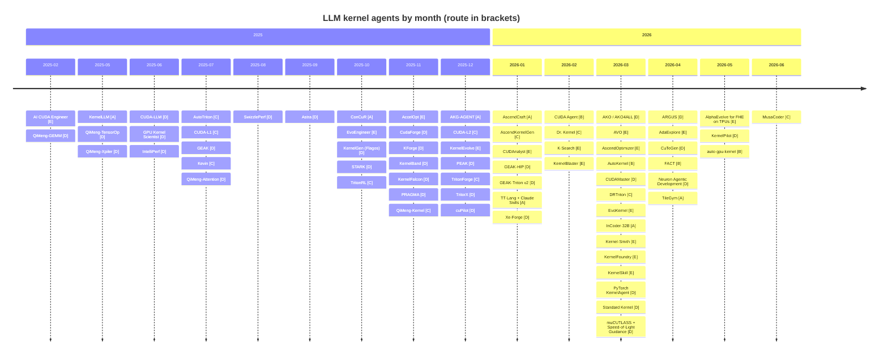

# Awesome Kernel Agent（中文版） [](https://awesome.re) [](CONTRIBUTING.md)

> 一份带**主张标注**（claims-annotated）的 LLM Kernel Agent 精选列表——自动生成/优化 GPU/NPU/ASIC kernel 的系统、数据集与工具链。English version: [README.md](README.md)（表格内容为英文，两版共享同一数据源）

**Kernel Agent** 指用 LLM（单模型或多智能体系统）自动编写或迭代优化加速器上算子级代码（kernel）的系统。本列表的独特之处：**给每个条目的头条数字标注证据姿态**——在哪评测的、加速比相对什么、生成的 kernel 能否被独立复跑。

姊妹列表：[**awesome-kernel-benchmark**](https://github.com/youyve/awesome-kernel-benchmark)——151 个 benchmark + 方法学记分卡。唯一数据源：[`data/agents.yaml`](data/agents.yaml)；下方表格均为生成产物，请勿手改。

<!-- BEGIN:STATS -->
<!-- generated by scripts/generate.py — do not edit by hand -->

**69 agent systems** (+3 tooling entries) across **14 DSLs/backends** · last data update **2026-06**.

| Route | A single-shot | B iterative | C RL | D multi-agent+profiler | E evolutionary |
|:---|:--:|:--:|:--:|:--:|:--:|
| **Count** | 7 | 4 | 11 | 32 | 15 |

| Status | 🟢 open | 🟡 partial | 🟠 wip | ⚪ closed | ⚫ proprietary |
|:---|:--:|:--:|:--:|:--:|:--:|
| **Count** | 29 | 12 | 7 | 19 | 2 |

Only **6/69** agent systems ship re-runnable generated kernels (`ships kernels: ✅`) — the rest of the headline speedups cannot be independently audited.

<!-- END:STATS -->

---

## 图例

**开源状态：** 🟢 OPEN（代码公开）· 🟡 PARTIAL（权重/数据公开但实现缺失）· 🟠 WIP（仓库施工中）· ⚪ CLOSED（仅论文）· ⚫ PROPRIETARY（刻意闭源的生产系统）。

**技术路线：** **[A]** 单发生成/翻译 · **[B]** 迭代精化（免训练反馈环）· **[C]** 多轮 RL（GRPO/PPO，可验证奖励）· **[D]** 多智能体 + profiler（NCU/msprof 在环）· **[E]** 进化搜索 + 记忆。

**主张标注**（每条下方的 `<sub>` 行）——条目描述原样转述自报数字，因此每条都附带客观的证据姿态标注，而非编辑评判：

| 字段 | 含义 |
|:---|:---|
| `eval:` | 头条数字来自哪个 benchmark/负载（可对照其[方法学记分卡](https://github.com/youyve/awesome-kernel-benchmark/blob/main/README.zh.md)判断 oracle/计时强弱） |
| `claim vs:` | 自报加速比相对**什么**（eager ≠ compile ≠ vendor ≠ 专家——比 eager 快 5× 可能仍比 cuBLAS 慢） |
| `ships kernels:` | ✅ 生成的 kernel 公开可复跑（= 可审计）· — 未公开 · ? 未核实 |
| `budget:` | ✅ 尝试次数/迭代/算力预算已披露 · — 只报最优结果 · ? 未核实 |

字段**只依据一手证据填写**；`?` 意为"尚未核实"，绝不是猜测。

## 按主 DSL 分组的 Agent

> 组内按时间倒序。多 DSL 系统只在主 DSL 下列一次，带 `· also:` 标签与交叉引用。

<!-- BEGIN:AGENTS -->
<!-- generated by scripts/generate.py — do not edit by hand -->

### Triton

> Largest ecosystem — Python-like syntax and abundant pretraining data make it the LLM lingua franca.

- [KernelPilot](https://github.com/BBuf/kernel-pilot) — BBuf · 2026-05 · **[D]** · 🟢 OPEN · also: CUDA
  Autonomous Triton/CUDA optimization with NCU feedback over a Humanize RLCR runtime; 84-iteration budget.
  <sub>eval: ? · claim vs: unknown · ships kernels: ? · budget: ✅</sub>
- [DRTriton](https://arxiv.org/abs/2603.21465) — Texas A&M · 2026-03 · **[C]** · 🟠 WIP
  Scalable RL (CSP-DAG synthetic data + curriculum RL + test-time search); DRTriton-7B speeds up 92% of KernelBench L2 vs 23% for GPT-5.2.
  <sub>eval: KernelBench · claim vs: PyTorch eager (KernelBench fast_1) · ships kernels: ? · budget: ◐</sub>
- [Kernel-Smith](https://arxiv.org/abs/2603.28342) — Shanghai AI Lab · 2026-03 · **[E]** · ⚪ CLOSED
  Evolutionary kernel optimization; upstream contributions to SGLang/LMDeploy.
  <sub>eval: ? · claim vs: unknown · ships kernels: — · budget: ?</sub>
- [PyTorch KernelAgent](https://github.com/meta-pytorch/KernelAgent) — Meta / PyTorch · 2026-03 · **[D]** · 🟢 OPEN
  5-agent system (Profiler / Judge / Analyze / Orchestrator / Benchmark) + NCU + roofline. H100 89% of roofline, 1.56x over torch.compile. [Blog](https://pytorch.org/blog/kernelagent-hardware-guided-gpu-kernel-optimization-via-multi-agent-orchestration/)
  <sub>eval: ? · claim vs: torch.compile (+ roofline fraction) · ships kernels: ? · budget: ?</sub>
- [AKO / AKO4ALL](https://github.com/TongmingLAIC/AKO4ALL) — TLAIC · 2026-03 · **[D]** · 🟢 OPEN · also: CUDA, TileLang
  Generic coding-agent harness for kernel optimization; 10/13 kernels beat the NVIDIA baseline on SOL-ExecBench. [Blog](https://tongminglaic.github.io/AKO/)
  <sub>eval: SOL-ExecBench · claim vs: SOL-ExecBench agent-optimized baseline · ships kernels: ? · budget: ?</sub>
- [Dr. Kernel](https://github.com/hkust-nlp/KernelGYM) — HKUST-NLP · 2026-02 · **[C]** · 🟢 OPEN
  14B model trained in the KernelGYM RL environment; matches Claude 4.5 Sonnet on KernelBench. [Paper](https://arxiv.org/abs/2602.05885)
  <sub>eval: KernelBench · claim vs: PyTorch eager (KernelBench) · ships kernels: ? · budget: ?</sub>
- [GEAK-Triton v2](https://github.com/AMD-AGI/GEAK) — AMD-AGI · 2026-01 · **[D]** · 🟢 OPEN
  Extension of the GEAK family for AMD GPUs. [Blog](https://rocm.blogs.amd.com/artificial-intelligence/geak-agents-family/README.html)
  <sub>eval: GEAK benchmarks (TritonBench-revised + ROCm) · claim vs: expert reference kernels · ships kernels: ? · budget: ✅</sub>
- [Xe-Forge](https://github.com/IntelLabs/Xe-Forge) — Intel Labs · 2026-01 · **[D]** · 🟢 OPEN
  Multi-stage LLM agent pipeline optimizing Triton kernels on Intel XPU.
  <sub>eval: ? · claim vs: unknown · ships kernels: ? · budget: ?</sub>
- [AKG-AGENT](https://github.com/mindspore-ai/akg/tree/master/akg_agents) — Huawei x Hunan U · 2025-12 · **[A]** · 🟢 OPEN · also: TileLang, AscendC, CUDA
  Multi-agent (Designer / Coder / Verifier / Conductor) builds a DSL-agnostic 'Unified Sketch' then lowers to 5 backends across NVIDIA GPU + Ascend NPU + CPU; 100% on KernelBench L1 (Triton-CUDA pass@4); 1.46x geomean over PyTorch eager on Triton-Ascend. [Paper](https://arxiv.org/abs/2512.23424)
  <sub>eval: KernelBench · claim vs: PyTorch eager · ships kernels: ? · budget: ✅</sub>
- [TritonForge](https://github.com/RLsys-Foundation/TritonForge) — RLsys-Foundation · 2025-12 · **[C]** · 🟢 OPEN
  SFT + RL for PyTorch-to-Triton conversion; NVIDIA + AMD cross-platform. [Paper](https://arxiv.org/abs/2512.09196)
  <sub>eval: ? · claim vs: unknown · ships kernels: ? · budget: ?</sub>
- [TritorX](https://arxiv.org/abs/2512.10977) — Meta · 2025-12 · **[D]** · ⚪ CLOSED
  Generates functionally-correct Triton ATen kernels at scale for emerging accelerators; 481 ATen operators passing 20,000+ PyTorch OpInfo tests. *Targets MTIA.*
  <sub>eval: PyTorch OpInfo (correctness) · claim vs: correctness-only (no speedup claim) · ships kernels: — · budget: ?</sub>
- [KernelFalcon](https://github.com/meta-pytorch/KernelAgent) — Meta / PyTorch · 2025-11 · **[D]** · 🟢 OPEN
  Predecessor of PyTorch KernelAgent; 100% correctness on all 250 KernelBench L1/L2/L3 tasks. [Blog](https://pytorch.org/blog/kernelfalcon-autonomous-gpu-kernel-generation-via-deep-agents/)
  <sub>eval: KernelBench · claim vs: PyTorch eager (KernelBench) · ships kernels: ? · budget: ?</sub>
- [KernelBand](https://arxiv.org/abs/2511.18868) — PKU · 2025-11 · **[D]** · ⚪ CLOSED
  Hierarchical multi-armed bandit for hardware-aware optimization.
  <sub>eval: ? · claim vs: unknown · ships kernels: — · budget: ?</sub>
- [PRAGMA](https://arxiv.org/abs/2511.06345) — Beihang University · 2025-11 · **[D]** · ⚪ CLOSED
  Profiling-reasoned multi-agent framework.
  <sub>eval: ? · claim vs: unknown · ships kernels: — · budget: ?</sub>
- [TritonRL](https://arxiv.org/abs/2510.17891) — Princeton / UW · 2025-10 · **[C]** · ⚪ CLOSED
  Trains LLMs to write Triton without 'cheating' (reward-hacking sanitization).
  <sub>eval: KernelBench · claim vs: unknown · ships kernels: — · budget: ?</sub>
- [ConCuR](https://huggingface.co/lkongam/KernelCoder) — HKUST · 2025-10 · **[A]** · 🟢 OPEN
  Conciseness-driven SFT for kernel generation. [Paper](https://arxiv.org/abs/2510.07356)
  <sub>eval: KernelBench · claim vs: unknown · ships kernels: ? · budget: ?</sub>
- [KernelGen (Flagos)](https://github.com/flagos-ai/kernelgen) — Flagos · 2025-10 · **[D]** · 🟢 OPEN
  Interactive kernel generation platform. [Blog](https://kernelgen.flagos.io/)
  <sub>eval: ? · claim vs: unknown · ships kernels: ? · budget: ?</sub>
- [SwizzlePerf](https://arxiv.org/abs/2508.20258) — Harvard x AMD · 2025-08 · **[D]** · ⚪ CLOSED
  Hardware-aware LLM for GPU kernel performance optimization.
  <sub>eval: ? · claim vs: unknown · ships kernels: — · budget: ?</sub>
- [GEAK](https://github.com/AMD-AGI/GEAK) — AMD-AGI · 2025-07 · **[D]** · 🟢 OPEN
  4-module agent (generator / reflector / evaluator / optimizer); 2.59x speedup on MI300X. [Paper](https://arxiv.org/abs/2507.23194) *The only system decomposing sequential@k vs parallel@k budget.*
  <sub>eval: TritonBench-revised (184 kernels) + 30 ROCm kernels · claim vs: expert reference kernels · ships kernels: ? · budget: ✅</sub>
- [AutoTriton](https://github.com/AI9Stars/AutoTriton) — THUNLP / AI9Stars · 2025-07 · **[C]** · 🟢 OPEN
  8B model trained via SFT + GRPO on 14.1K torch-triton pairs. [Paper](https://arxiv.org/abs/2507.05687)
  <sub>eval: KernelBench / TritonBench · claim vs: unknown · ships kernels: ? · budget: ?</sub>
- [KernelLLM](https://huggingface.co/facebook/KernelLLM) — Meta · 2025-05 · **[A]** · 🟡 PARTIAL
  Llama 3.1 8B fine-tuned on KernelBook (~25K torch-triton pairs); beats GPT-4o on KernelBench-Triton L1.
  <sub>eval: KernelBench-Triton · claim vs: PyTorch eager (KernelBench) · ships kernels: ? · budget: ?</sub>

<sub>Cross-listed: **AutoKernel** (see CUDA / CUDA-C++) · **KernelEvolve** (see CUDA / CUDA-C++) · **IntelliPerf** (see HIP / ROCm (AMD))</sub>

### CUDA / CUDA-C++

> The performance-ceiling battleground — RL training, evolutionary search, and multi-agent orchestration.

- [AdaExplore](https://github.com/StigLidu/AdaExplore) — CMU · 2026-04 · **[E]** · 🟢 OPEN
  Failure-driven, diversity-preserving exploration. [Paper](https://arxiv.org/abs/2604.16625)
  <sub>eval: KernelBench · claim vs: unknown · ships kernels: ? · budget: ?</sub>
- [AVO](https://github.com/austin1997/AVO) — NVIDIA x OctoML (23 authors) · 2026-03 · **[E]** · 🟡 PARTIAL · also: PTX
  Paradigm shift: the agent IS the variation operator (propose / repair / critique / verify), not just a candidate generator. After 7 days of autonomous evolution on B200 MHA: +3.5% over cuDNN, +10.5% over FlashAttention-4. [Paper](https://arxiv.org/abs/2603.24517) *Linked repo is a community reimplementation.*
  <sub>eval: B200 MHA workloads · claim vs: cuDNN / FlashAttention-4 (vendor & expert tier) · ships kernels: — · budget: ✅</sub>
- [AutoKernel](https://github.com/RightNow-AI/autokernel) — RightNow AI (YC) · 2026-03 · **[B]** · 🟢 OPEN · also: Triton
  Keep/revert agent loop with Amdahl-law profiling and a 5-stage correctness harness (~40 experiments/hr); H100 RMSNorm 5.29x over eager / 2.83x over torch.compile. [Paper](https://arxiv.org/abs/2603.21331)
  <sub>eval: ? · claim vs: PyTorch eager AND torch.compile (both reported) · ships kernels: ? · budget: ✅</sub>
- [KernelSkill](https://github.com/0satan0/KernelMem) — Beihang University · 2026-03 · **[E]** · 🟢 OPEN
  Dual-level memory with reusable expert skills; KernelBench L1=5.44x, L2=2.82x, L3=1.92x. [Paper](https://arxiv.org/abs/2603.10085)
  <sub>eval: KernelBench · claim vs: PyTorch eager (KernelBench) · ships kernels: ? · budget: ?</sub>
- [CUDAMaster](https://hanyx2021.github.io/MSKernelBenchDemo/) — Tsinghua · 2026-03 · **[D]** · 🟡 PARTIAL
  Bottleneck-aware filtered-profiling multi-agent + full toolchain generation across algebra / LLM / sparse / scientific kernels; ~35% over Astra, occasionally matches cuBLAS. Introduces MSKernelBench. [Paper](https://arxiv.org/abs/2603.07169)
  <sub>eval: MSKernelBench · claim vs: Astra (prior agent); cuBLAS occasionally matched · ships kernels: ? · budget: ?</sub>
- [InCoder-32B](https://github.com/CSJianYang/Industrial-Coder) — Beihang University · 2026-03 · **[A]** · 🟢 OPEN
  Industrial code foundation model; the 2026-04 InCoder-32B-Thinking variant adds an industrial code world model (ICWM) for pre-compilation self-verification, 38.0% on KernelBench, runs on RTX 4090. [Paper](https://arxiv.org/abs/2604.03144)
  <sub>eval: KernelBench · claim vs: PyTorch eager (KernelBench) · ships kernels: ? · budget: ?</sub>
- [CUDA Agent](https://cuda-agent.github.io/) — ByteDance x Tsinghua · 2026-02 · **[B]** · 🟡 PARTIAL
  Large-scale agentic RL on Seed-1.6 MoE (OpenHands ReAct loop, 200 turns, 131K ctx); first open agent to beat Claude Opus and Gemini 3 Pro on KernelBench (2.11x geomean over torch.compile). [Paper](https://huggingface.co/papers/2602.24286) *Companion model repo: ByteDance-Seed/cudaLLM.*
  <sub>eval: KernelBench · claim vs: torch.compile (geomean) · ships kernels: ? · budget: ✅</sub>
- [KernelBlaster](https://arxiv.org/abs/2602.14293) — NVIDIA x UC Berkeley · 2026-02 · **[E]** · ⚪ CLOSED
  Memory-augmented in-context RL; persistent CUDA knowledge base.
  <sub>eval: ? · claim vs: unknown · ships kernels: — · budget: ?</sub>
- [K-Search](https://github.com/caoshiyi/K-Search) — UC Berkeley · 2026-02 · **[E]** · 🟢 OPEN
  Co-evolving intrinsic world model for kernel generation. [Paper](https://arxiv.org/abs/2602.19128)
  <sub>eval: ? · claim vs: unknown · ships kernels: ? · budget: ?</sub>
- [CUDAnalyst](https://github.com/yuxuan-z19/cudanalyst) — Yee Hin Chong et al. · 2026-01 · **[E]** · 🟢 OPEN
  Self-evolving agent (OpenEvolve + LLM4AD/EoH) that decouples feedback acquisition (Debugger / Analyzer / Profiler) from plan generation, doing causal generation-level attribution of which feedback signal drives the next plan. ICML'26. [Paper](https://openreview.net/forum?id=s70zO5Lvvj) *Ships generated sol.cu kernels - auditable.*
  <sub>eval: PolyBench-ACC / NPB / XSBench · claim vs: substrate reference implementations · ships kernels: ✅ · budget: ?</sub>
- [KernelEvolve](https://arxiv.org/abs/2512.23236) — Meta · 2025-12 · **[E]** · ⚫ PROPRIETARY · also: Triton, TileLang, CUTLASS, HIP
  Six-component agent (synthesizer + MCTS/evolutionary tree search + self-evolving RAG skill library + agentic RL) deployed on Andromeda ads: NVIDIA +60% / MTIA +25% / peak 17x; 100% on KernelBench. ISCA'26. [Blog](https://engineering.fb.com/2026/04/02/developer-tools/kernelevolve-how-metas-ranking-engineer-agent-optimizes-ai-infrastructure/)
  <sub>eval: KernelBench / production Andromeda workloads · claim vs: production incumbents (internal) · ships kernels: — · budget: ?</sub>
- [CUDA-L2](https://github.com/deepreinforce-ai/CUDA-L2) — DeepReinforce · 2025-12 · **[C]** · 🟢 OPEN
  Surpasses cuBLAS for matrix multiplication. [Paper](https://arxiv.org/abs/2512.02551)
  <sub>eval: matmul suite · claim vs: cuBLAS (vendor tier) · ships kernels: ? · budget: ?</sub>
- [cuPilot](https://github.com/champloo2878/cuPilot-Kernels) — Southeast U x Tsinghua · 2025-12 · **[D]** · 🟡 PARTIAL
  Strategy-coordinated multi-agent framework. [Paper](https://arxiv.org/abs/2512.16465) *Linked repo holds generated kernel outputs.*
  <sub>eval: KernelBench · claim vs: unknown · ships kernels: ✅ · budget: ?</sub>
- [PEAK](https://arxiv.org/abs/2512.19018) — Stanford x MSR Redmond · 2025-12 · **[D]** · ⚪ CLOSED · also: HIP
  Natural-language transformation for kernel optimization.
  <sub>eval: ? · claim vs: unknown · ships kernels: — · budget: ?</sub>
- [CudaForge](https://github.com/OptimAI-Lab/CudaForge) — UMN OptimAI Lab · 2025-11 · **[D]** · 🟢 OPEN
  Training-free Coder + Judge dual-agent with NCU profiling; A100 97.6% correctness, 1.68x / 2.27x - beats Kevin-32B. [Paper](https://arxiv.org/abs/2511.01884)
  <sub>eval: KernelBench · claim vs: PyTorch eager (KernelBench) · ships kernels: ? · budget: ?</sub>
- [KForge](https://arxiv.org/abs/2511.13274) — Gimlet Labs · 2025-11 · **[D]** · ⚪ CLOSED
  Program synthesis for diverse AI hardware accelerators.
  <sub>eval: ? · claim vs: unknown · ships kernels: — · budget: ?</sub>
- [QiMeng-Kernel](https://github.com/QiMeng-IPRC/QiMeng-Kernel) — CAS ICT · 2025-11 · **[C]** · 🟡 PARTIAL
  Macro-Thinking Micro-Coding (MTMC); ~100% on L1/L2, ~70% on L3. AAAI'26. QiMeng family (CAS ICT full-stack processor auto-design). [Paper](https://arxiv.org/abs/2511.20100) *Repo has no impl code yet.*
  <sub>eval: KernelBench · claim vs: PyTorch eager (KernelBench) · ships kernels: — · budget: ?</sub>
- [STARK](https://arxiv.org/abs/2510.16996) — Meta · 2025-10 · **[D]** · ⚪ CLOSED
  Strategic team of agents for refining kernels.
  <sub>eval: ? · claim vs: unknown · ships kernels: — · budget: ?</sub>
- [EvoEngineer](https://arxiv.org/abs/2510.03760) — City University of Hong Kong · 2025-10 · **[E]** · ⚪ CLOSED
  Automated CUDA kernel code evolution; median 2.72x, peak 36.75x speedup.
  <sub>eval: KernelBench · claim vs: PyTorch eager (KernelBench) · ships kernels: — · budget: ?</sub>
- [Astra](https://github.com/Anjiang-Wei/Astra) — Stanford · 2025-09 · **[D]** · 🟢 OPEN
  Multi-agent GPU kernel optimization on SGLang; 1.32x average zero-shot with o4-mini. NeurIPS'25. [Paper](https://arxiv.org/abs/2509.07506)
  <sub>eval: SGLang kernels · claim vs: SGLang incumbent kernels · ships kernels: ? · budget: ✅</sub>
- [Kevin](https://arxiv.org/abs/2507.11948) — Cognition · 2025-07 · **[C]** · 🟡 PARTIAL
  Multi-turn RL on QwQ-32B with GRPO; KernelBench correctness 56%->82%, speedup 0.53x->1.10x.
  <sub>eval: KernelBench · claim vs: PyTorch eager (KernelBench) · ships kernels: ? · budget: ✅</sub>
- [CUDA-L1](https://github.com/deepreinforce-ai/CUDA-L1) — DeepReinforce · 2025-07 · **[C]** · 🟢 OPEN
  Contrastive RL; KernelBench avg 3.12x, peak 120x; A100->H100/L40/3090 generalization. [Paper](https://arxiv.org/abs/2507.14111) *The 120x peak is exactly the inflated-claim regime robust-kbench later showed collapses under hardened evaluation.*
  <sub>eval: KernelBench · claim vs: PyTorch eager (KernelBench) · ships kernels: ✅ · budget: ?</sub>
- [QiMeng-Attention](https://aclanthology.org/2025.findings-acl.446/) — CAS ICT · 2025-07 · **[D]** · ⚪ CLOSED
  Self-optimizing attention code; MLA 2.15x cuDNN on A100. ACL'25 Findings. QiMeng family.
  <sub>eval: attention workloads · claim vs: cuDNN (vendor tier) · ships kernels: — · budget: ?</sub>
- [GPU Kernel Scientist](https://arxiv.org/abs/2506.20807) — Anonymous · 2025-06 · **[D]** · ⚪ CLOSED
  Hypothesis-driven iterative kernel optimization.
  <sub>eval: ? · claim vs: unknown · ships kernels: — · budget: ?</sub>
- [CUDA-LLM](https://arxiv.org/abs/2506.09092) — Shanghai Jiao Tong University · 2025-06 · **[D]** · ⚪ CLOSED
  Hardware-aware prompts for efficient CUDA generation.
  <sub>eval: ? · claim vs: unknown · ships kernels: — · budget: ?</sub>
- [QiMeng-Xpiler](https://arxiv.org/abs/2505.02146) — CAS ICT x USTC x Cambricon · 2025-05 · **[D]** · 🟠 WIP · also: HIP
  Neural-symbolic tensor-program transcompiler (LLM transform + SMT repair + hierarchical auto-tuning); ~95% translation accuracy across 4 backends, up to 2.0x over vendor libraries. OSDI'25. QiMeng family.
  <sub>eval: 4-backend transpilation suite · claim vs: vendor libraries · ships kernels: ? · budget: ?</sub>
- [QiMeng-TensorOp](https://arxiv.org/abs/2505.06302) — CAS ICT · 2025-05 · **[D]** · ⚪ CLOSED
  MCTS + hardware primitives; 251% OpenBLAS on RISC-V, 124% cuBLAS on NVIDIA. IJCAI'25. QiMeng family.
  <sub>eval: GEMM/tensor-op suite · claim vs: OpenBLAS / cuBLAS (vendor tier) · ships kernels: — · budget: ?</sub>
- [AI CUDA Engineer](https://huggingface.co/datasets/SakanaAI/AI-CUDA-Engineer-Archive) — Sakana AI · 2025-02 · **[E]** · 🟡 PARTIAL
  Four-stage pipeline (Convert / Translate / Optimize / Compose); 30K-kernel archive (17K verified). [Paper](https://arxiv.org/abs/2509.14279) *Cautionary tale: initial 10-100x claims included reward-hacking exploits, later hardened in robust-kbench (paper 2025-09).*
  <sub>eval: KernelBench · claim vs: PyTorch eager (KernelBench) · ships kernels: ✅ · budget: ?</sub>
- [QiMeng-GEMM](https://ojs.aaai.org/index.php/AAAI/article/view/34461) — CAS ICT · 2025-02 · **[D]** · 🟡 PARTIAL
  Meta-prompt + Tree-of-Thought for GEMM; 211% OpenBLAS, 115% cuBLAS. AAAI'25. QiMeng family.
  <sub>eval: GEMM suite · claim vs: OpenBLAS / cuBLAS (vendor tier) · ships kernels: ? · budget: ?</sub>

<sub>Cross-listed: **MusaCoder** (see Emerging DSLs & other accelerators) · **KernelPilot** (see Triton) · **AKO / AKO4ALL** (see Triton) · **KernelFoundry** (see SYCL (Intel)) · **AKG-AGENT** (see Triton)</sub>

### CUTLASS / CuTe DSL

> Template-level performance with a steep learning curve — agents must reason about tiles, layouts, and warp specialization.

- [CuTeGen](https://github.com/taratt/cutegen) — U Toronto x Standard Kernel · 2026-04 · **[D]** · 🟢 OPEN
  Generate-test-refine loop with a 'delayed profiling' schedule (withholds low-level NCU feedback until structure stabilizes); 1.71x avg over PyTorch on 209 KernelBench L1/L2 tasks vs CudaForge 0.89x, zero low-precision shortcuts. [Paper](https://arxiv.org/abs/2604.01489)
  <sub>eval: KernelBench · claim vs: PyTorch eager (KernelBench) · ships kernels: ? · budget: ?</sub>
- [FACT](https://arxiv.org/abs/2604.26666) — Heidari & Nikolopoulos · 2026-04 · **[B]** · ⚪ CLOSED
  Three-stage agentic workflow (pattern discovery / realization / composition) transpiling PyTorch modules into auto-tuned CUTLASS; 2.03x on MiniGPT, 1.41x on Llama-3-8B over PyTorch eager.
  <sub>eval: MiniGPT / Llama-3-8B end-to-end · claim vs: PyTorch eager · ships kernels: — · budget: ?</sub>
- [muCUTLASS + Speed-of-Light Guidance](https://arxiv.org/abs/2603.29010) — NVIDIA x Stanford · 2026-03 · **[D]** · 🟠 WIP
  Two design principles for kernel-opt agents: a compact in-context-learnable DSL (muCUTLASS over CUTLASS) + first-principles Speed-of-Light bounds to budget trials and flag benchmark gaming; GPT-5-mini 0.40x->1.27x, +SOL up to 2.07x, saving 19-43% tokens.
  <sub>eval: ? · claim vs: PyTorch eager + SOL ceiling · ships kernels: ? · budget: ✅</sub>

<sub>Cross-listed: **KernelEvolve** (see CUDA / CUDA-C++)</sub>

### Ascend C / NPU

> The fastest-growing non-NVIDIA stack — but mostly closed.

- [AscendOptimizer](https://arxiv.org/abs/2603.23566) — ECNU x Tongji · 2026-03 · **[E]** · 🟡 PARTIAL
  Episodic agent for Ascend NPU operator optimization; 1.21x geomean on 127 AscendC operators, 49.61% beat references.
  <sub>eval: cann-ops (127 AscendC operators) · claim vs: Ascend reference operators · ships kernels: ? · budget: ?</sub>
- [EvoKernel](https://evokernel.zhuo.li/) — SJTU · 2026-03 · **[E]** · 🟡 PARTIAL
  Cold-start drafting + continual refining with value-driven memory (stage-specific Q-values, cross-task sharing, no fine-tuning); correctness 11%->83%, median 3.60x. [Paper](https://arxiv.org/abs/2603.10846) *Paper frames the target as generic NPU/DSA; Ascend inferred.*
  <sub>eval: ? · claim vs: unknown · ships kernels: ? · budget: ?</sub>
- [AscendKernelGen](https://huggingface.co/datasets/AscendKernelGen/Ascend-COT-v1) — Pengcheng Lab · 2026-01 · **[C]** · 🟡 PARTIAL
  Ascend-CoT dataset + RLEF training; L2 compilation 0%->95.5%. [Paper](https://arxiv.org/abs/2601.07160)
  <sub>eval: NPUKernelBench · claim vs: unknown · ships kernels: ? · budget: ?</sub>
- [AscendCraft](https://arxiv.org/abs/2601.22760) — NJU x Huawei · 2026-01 · **[A]** · ⚪ CLOSED
  DSL-guided, training-free transcompilation; 98.1% compilation, 90.4% correctness.
  <sub>eval: ? · claim vs: correctness-only claims · ships kernels: — · budget: ?</sub>

<sub>Cross-listed: **AKG-AGENT** (see Triton)</sub>

### HIP / ROCm (AMD)

- [ARGUS](https://arxiv.org/abs/2604.18616) — Mai, Kozyrakis, Yuan et al. · 2026-04 · **[D]** · 🟠 WIP
  Agentic optimization guided by compile-time data-flow invariants (abstract interpretation + SMT with counterexamples) + in-context RL planner; on MI300X reaches 99-104% of hand-tuned assembly, 2-1543x faster than prior agentic systems, 100% KernelBench L1 / 90% L2.
  <sub>eval: KernelBench · claim vs: hand-tuned assembly (expert tier) + prior agents · ships kernels: ? · budget: ?</sub>
- [GEAK-HIP](https://github.com/AMD-AGI/GEAK) — AMD-AGI · 2026-01 · **[D]** · 🟢 OPEN
  GEAK extension for HIP optimization. [Blog](https://rocm.blogs.amd.com/software-tools-optimization/geak-hip-optimizations/README.html)
  <sub>eval: ? · claim vs: unknown · ships kernels: ? · budget: ?</sub>
- [IntelliPerf](https://github.com/AMDResearch/intelliperf) — AMD Research · 2025-06 · **[D]** · 🟢 OPEN · also: Triton
  Profiling-guided LLM framework for AMD GPUs.
  <sub>eval: ? · claim vs: unknown · ships kernels: ? · budget: ?</sub>
- [IntelliKit](https://github.com/AMDResearch/intellikit) — AMD Research · 2025-03 · *tooling* · 🟢 OPEN
  LLM-ready profiling toolkit for AMD GPUs.
  <sub>eval: ? · claim vs: n/a (tooling) · ships kernels: ? · budget: ?</sub>

<sub>Cross-listed: **KernelEvolve** (see CUDA / CUDA-C++) · **PEAK** (see CUDA / CUDA-C++) · **QiMeng-Xpiler** (see CUDA / CUDA-C++)</sub>

### NKI (AWS Trainium)

- [Neuron Agentic Development](https://aws.amazon.com/about-aws/whats-new/2026/04/announcing-neuron-agentic-development/) — AWS · 2026-04 · **[D]** · ⚫ PROPRIETARY
  Official AWS announcement of agentic NKI kernel development.
  <sub>eval: ? · claim vs: unknown · ships kernels: — · budget: ?</sub>
- [AccelOpt](https://github.com/zhang677/AccelOpt) — Stanford x AWS · 2025-11 · **[E]** · 🟠 WIP
  Self-improving agentic system for accelerator kernels; 45%->71% peak throughput on Trainium 1/2. Ships the NKIBench suite. MLSys'26. [Paper](https://arxiv.org/abs/2511.15915)
  <sub>eval: NKIBench · claim vs: fraction of peak throughput (ceiling-relative) · ships kernels: ? · budget: ?</sub>

### SYCL (Intel)

- [KernelFoundry](https://arxiv.org/abs/2603.12440) — Intel · 2026-03 · **[E]** · 🟠 WIP · also: CUDA
  Hardware-aware evolutionary optimization (MAP-Elites quality-diversity + meta-prompting) generating CUDA AND SYCL; demonstrated on Intel Arc B580 (Xe2).
  <sub>eval: ? · claim vs: unknown · ships kernels: ? · budget: ?</sub>

### TileLang

- [TileOPs (TOPS)](https://github.com/tile-ai/TileOPs) — tile-ai · 2026-01 · *tooling* · 🟢 OPEN
  Spec-driven operator library: AI agents read declarative manifests (signatures, workloads, roofline formulas), generate TileLang kernels, and self-validate against Speed-of-Light bounds.
  <sub>eval: ? · claim vs: SOL bounds (self-validation) · ships kernels: ✅ · budget: ?</sub>
- [TileLang-Ascend](https://github.com/tile-ai/tilelang-ascend) — tile-ai · 2025-10 · *tooling* · 🟢 OPEN
  Adapter layer connecting TileLang to the Ascend backend (not an agent).
  <sub>eval: ? · claim vs: n/a (tooling) · ships kernels: ? · budget: ?</sub>

<sub>Cross-listed: **AKO / AKO4ALL** (see Triton) · **AKG-AGENT** (see Triton) · **KernelEvolve** (see CUDA / CUDA-C++)</sub>

### Emerging DSLs & other accelerators

> New backends where AI codegen is in the loop from day one.

- [MusaCoder](https://arxiv.org/abs/2606.04847) — Moore Threads · 2026-06 · **[C]** · 🟠 WIP · also: CUDA
  Full-stack training (progressive data synthesis + diversity-preserving rejection FT + execution-feedback RL via MooreEval) for native kernels on the domestic Moore Threads MUSA backend; 9B matches frontier closed models, 27B sets SOTA on a MUSA-ported KernelBench.
  <sub>eval: KernelBench-MUSA (MooreEval) · claim vs: platform PyTorch (MUSA port) · ships kernels: ? · budget: ?</sub>
- [auto-gpu-kernel](https://github.com/Dogacel/auto-gpu-kernel) — Dogacel · 2026-05 · **[B]** · 🟢 OPEN
  Claude-Code-driven autonomous optimizer that won #1 (agent-only) in the MLSys'26 FlashInfer contest, DeepSeek Sparse Attention track, avg 34.93x speedup; runs /optimize every 15 min indefinitely on Modal cloud.
  <sub>eval: MLSys'26 FlashInfer contest (bare-metal B200 evals) · claim vs: contest reference kernels · ships kernels: ✅ · budget: ◐</sub>
- [AlphaEvolve for FHE on TPUs](https://arxiv.org/abs/2605.14718) — Google · 2026-05 · **[E]** · ⚪ CLOSED
  Applies AlphaEvolve evolutionary codegen to fully-homomorphic-encryption kernels on TPU v5e; within 24h: 2.5x TFHE bootstrap, 1.31x CKKS rotation vs human SOTA.
  <sub>eval: FHE kernel suite (TFHE/CKKS) · claim vs: human SOTA implementations (expert tier) · ships kernels: — · budget: ✅</sub>
- [TileGym](https://github.com/NVIDIA/TileGym) — NVIDIA · 2026-04 · **[A]** · 🟢 OPEN
  LLM agent 'skill' auto-translating cuTile Python kernels to cuTile.jl (Julia) in one validated pass (17 rules, static validator); GEMM port ~4 min / ~78K tokens, no manual intervention. [Blog](https://developer.nvidia.com/blog/automating-gpu-kernel-translation-with-ai-agents-cutile-python-to-cutile-jl/)
  <sub>eval: ? · claim vs: correctness-only (translation) · ships kernels: ✅ · budget: ✅</sub>
- [Standard Kernel](https://standardkernel.com/blog/announcing-our-seed-round-is-kernel-generation-solved/) — Standard Kernel (startup) · 2026-03 · **[D]** · ⚪ CLOSED
  Hybrid program-analysis + LLM reasoning at the PTX layer across Triton / TileLang / ThunderKittens / CUTLASS; reports 80%-4x end-to-end gains on H100. Raised $20M seed (Mar 2026; angels incl. Jeff Dean, Jonathan Frankle).
  <sub>eval: internal end-to-end workloads · claim vs: production incumbents (internal) · ships kernels: — · budget: —</sub>
- [TT-Lang + Claude Skills](https://github.com/tenstorrent/tt-lang) — Tenstorrent · 2026-01 · **[A]** · 🟢 OPEN
  Python-embedded DSL for Tenstorrent hardware with AI codegen in the loop; ships Claude Skills that convert CUDA/Triton/cuTile/TileLang kernels 'in seconds' + a functional simulator for hardware-free iteration.
  <sub>eval: ? · claim vs: unknown · ships kernels: ? · budget: ?</sub>

<!-- END:AGENTS -->

> **覆盖空白（尚无专属 agent）：** **ThunderKittens**（TK 2.0 已支持 Blackwell + MXFP8/NVFP4，kernel 仍是手写）· **Pallas (TPU)**（仅经 MultiKernelBench 评测）· **Triton Gluon**（更底层方言，完全空白）。

## Route × DSL 覆盖矩阵

<!-- BEGIN:MATRIX -->
<!-- generated by scripts/generate.py — do not edit by hand -->

| Route \ DSL | Triton | CUDA | CUTLASS | AscendC | HIP | NKI | SYCL | TileLang | Emerging | Σ |
|:---|:--:|:--:|:--:|:--:|:--:|:--:|:--:|:--:|:--:|:--:|
| A single-shot | 3 | 1 |  | 1 |  |  |  |  | 2 | 7 |
| B iterative |  | 2 | 1 |  |  |  |  |  | 1 | 4 |
| C multi-turn RL | 5 | 4 |  | 1 |  |  |  |  | 1 | 11 |
| D multi-agent+profiler | 12 | 13 | 2 |  | 3 | 1 |  |  | 1 | 32 |
| E evolutionary | 1 | 9 |  | 2 |  | 1 | 1 |  | 1 | 15 |
| tooling |  |  |  |  | 1 |  |  | 2 |  | 3 |

Empty cells are open gaps — e.g. no trained-RL (C) agent exists outside Triton/CUDA/Ascend/MUSA, and Pallas (TPU) / Triton-Gluon still have no dedicated agent at all.

<!-- END:MATRIX -->

## 时间线

<!-- BEGIN:TIMELINE -->
<!-- generated by scripts/generate.py — do not edit by hand -->



<!-- END:TIMELINE -->

---

## Benchmark · 数据集 · DSL · 工具 · 阅读清单

这些章节内容较稳定，详见英文版对应部分：[Benchmarks](README.md#benchmarks)（含 [评测诚信与 reward-hacking](README.md#evaluation-integrity--reward-hacking)、[竞赛与排行榜](README.md#competitions--leaderboards)）· [Datasets](README.md#datasets) · [DSL Languages](README.md#dsl-languages) · [Infrastructure & Tools](README.md#infrastructure--tools) · [Reading List](README.md#reading-list)（新人建议阅读顺序）。

## 贡献

编辑 [`data/agents.yaml`](data/agents.yaml)（绝不手改生成表格），跑 `python3 scripts/generate.py`，提交再生成的文件。主张标注字段必须来自一手证据（论文/harness/仓库）——填 `unknown` 永远合法，猜测不合法。**把一个 `?` 升级为有据可查的值，是本列表最欢迎的 PR。**

## 引用

```bibtex
@misc{you2026awesomekernelagent,
  author       = {Lianzhong You},
  title        = {Awesome Kernel Agent: A Claims-Annotated Catalog of
                  LLM-Driven Kernel Generation Systems},
  year         = {2026},
  publisher    = {GitHub},
  url          = {https://github.com/youyve/awesome-kernel-agent}
}
```

## 许可

目录内容 [CC-BY-4.0](LICENSE)（要求署名）· `scripts/` 代码 [MIT](scripts/LICENSE)。

---

**维护者** [Lianzhong You](mailto:youyve@foxmail.com) · HKUST (GZ)
